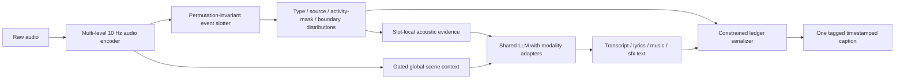

# SceneLedger：面向复杂真实声景的证据优先时间戳 Caption

> 更新说明：本文保留 SceneLedger 的总体任务与早期 event-ledger 论证；显式教师分轨、隐式 track/event 两级 slots、未知 source count、专家 caption 和受限 LLM 重写的实现级定义见 [08_hybrid_track_event_idea.md](08_hybrid_track_event_idea.md)。

## 1. 候选论文标题

**SceneLedger: Evidence-First Timestamped Captioning of Speech, Lyrics, Music, and Sound in Complex Acoustic Scenes**

备选标题：

- **Every Phrase Needs Evidence: Counterfactual Remix Learning for Complex Audio Captioning**
- **From Mixtures to Event Ledgers: Robust 100-ms Audio Captioning with Unlabeled Videos**

第一版标题更清楚地表达任务和结构；第二版更像顶会故事线，但只有在 evidence ablation 确实显著降低 hallucination 时才适合使用。

## 2. 中心论点

当前 LALM 把 dense caption 视为一个长文本序列，容易出现三个耦合错误：先由语言先验生成合理事件，再为其补时间；按开始时间自回归生成时难以表达重叠；对混响、回声和遮蔽引起的声学变化缺少守恒或等变约束。

SceneLedger 把输出视为一个**可变基数、允许重叠的事件集合**。每个事件先绑定 100 ms 活动轨迹和局部声学证据，文字只能在该证据上生成；集合随后被无损序列化成用户需要的统一 caption。无标注真实数据通过可验证的重混操作产生监督，而不是只让一个大模型凭空写 pseudo-caption。

核心假设可被明确证伪：

- H1：事件集合解码在并发声源数增加时，语义-时间 F1 的下降小于自回归 timestamp-token 基线；
- H2：反事实重混一致性比普通 pseudo-label SFT 更能降低真实复杂场景中的 hallucination 和 omission；
- H3：将文字限制在 slot-local evidence 上可提高事实性，但保留少量 gated global context 才能维持场景关系和音乐描述；
- H4：0.1 s soft boundary distributions 优于单个 hard timestamp token，尤其对瞬态和渐入/渐出事件。

## 3. 任务与输出

给定波形 $x \in \mathbb{R}^{T}$，模型输出事件集合：

$$
\mathcal{E}=\{e_i\}_{i=1}^{N},\qquad
e_i=(z_i, q_i, \mathcal{S}_i, c_i, u_i),
$$

其中：

- $z_i \in \{\text{speech},\text{lys},\text{music},\text{sfx}\}$；
- $q_i$ 是 source/speaker/track identity，可为空；
- $\mathcal{S}_i=\{[t^k_s,t^k_e]\}_k$ 是一个或多个不相交时间段，量化到 0.1 s；
- $c_i$ 是 transcript、lyrics 或自然语言描述；
- $u_i$ 包括置信度、可听性和边界不确定性。

同一来源的重复事件可共享 source ID 并包含多个 spans。不同事件允许重叠。`<speech>` 只表示说话，`<lys>` 只表示演唱歌词；无法可靠辨认歌词时可以输出 `<music>` 中“含模糊演唱”，而不能猜词。

规范输出示例：

```xml
<music id="M1" t="0.0-12.8" confidence="0.96">轻快电子伴奏，鼓点在 6.0 s 后增强。</music>
<speech speaker="S1" t="0.7-2.9" confidence="0.94">[快速] “我们现在开始。”</speech>
<lys singer="V1" t="3.2-6.1" confidence="0.81">“take me home tonight”</lys>
<sfx id="E1" t="4.6-4.9" confidence="0.91">一次近距离玻璃破碎声。</sfx>
<speech speaker="S2" t="4.7-7.0" confidence="0.76">第二名说话者在音乐上方回应，部分内容被破碎声遮蔽。</speech>
```

训练和评价以 [JSON Schema](../schemas/sceneledger.schema.json) 为唯一规范表示；XML-like caption 只是可读的确定性序列化，避免解析器与模型自由格式共同成为误差源。

## 4. 模型：Evidence-First Event Ledger



### 4.1 Audio encoder

工程底座确定为开放的 **MOSS-Audio-4B-Instruct**；8B 只在方法稳定后验证 scaling。其 `get_audio_features()` 可返回 12.5 Hz 最后层和 DeepStack 中间层，80 ms 帧率接近但并不等于 100 ms 精度。实现中比较两种 temporal fusion：插值为 10 Hz 活动网格，或保留 12.5 Hz 并回归连续 boundary offset，最后才量化为 0.1 s。完整选择依据和 wrapper 结构见[开源底座与实现蓝图](05_base_and_implementation.md)。

不要在论文初期从零训练通用 audio encoder。先冻结 encoder，对 event slotter、adapter 和 LoRA 做训练；只有 pilot 证明低层特征成为瓶颈，才解冻最后若干层。

### 4.2 Permutation-invariant event slotter

使用 $K$ 个可学习 queries 对多层时间特征做 deformable cross-attention。每个 query 输出：

- eventness/null；
- 四类 tag；
- 100 ms frame activity probabilities；
- onset/offset 的离散概率分布，而非一个数字 token；
- source embedding，用 supervised speaker/stem identity 和跨窗口对比 loss 约束；
- audibility/confidence；
- 可选的 time-frequency evidence mask。

训练时用 Hungarian matching 将预测 slots 与目标事件集合配对。活动 mask 允许同一个事件对应多段重复区间，从结构上解决 SpotSound 指出的 repeated-instance 问题。null slots 让模型能明确不预测，不必把每个 query 填成一个事件。

### 4.3 Evidence-conditioned text decoder

每个 slot 只从自己的 masked/local temporal evidence 生成主要文本；一个低容量 gate 决定是否读取全局 scene token。这样：

- speech slot 生成 speaker-aware transcript 和必要的 paralinguistic 属性；
- lyrics slot 生成唱词，低置信时拒绝逐词输出；
- music slot 描述结构、风格、乐器、节奏、动态和人声存在；
- sfx slot 生成开放词汇事件与声学属性。

四类使用共享 LLM 和轻量 modality adapters，而不是四套完全独立模型。共享参数保持单模型能力；adapters 减少 ASR、歌词和描述性语言之间的梯度冲突。第一版实现共享一次 audio encoder，所有有效 slots 批量解码 event text，再由 serializer 合成单一 caption；它对用户是一次 audio-to-caption 调用，也不再调用外部 Whisper，但不虚构为“所有事件只经过一次 autoregressive decode”。

### 4.4 Constrained serializer

时间来自 boundary/activity head，不由 LLM 自由生成数字。有限状态 grammar 按 onset、type、source ID 的确定规则把事件集合变成统一 caption。若同一事件有多个 spans，序列化为 `t="0.4-0.8,1.6-2.0"`；重叠不需要复制或改写其他事件。

## 5. Counterfactual Acoustic Remix Consistency (CARC)

### 5.1 为什么普通 pseudo-caption 不够

直接把 MOSS/Qwen/VLM 输出当真值会复制 teacher 的漏检、语言先验和视觉幻觉。CARC 只在可验证的**变化关系**上监督：即使不知道原视频的完整正确 caption，也知道加入、移除或平移一个已提取声源后，合理事件集合应怎样改变。

### 5.2 构造反事实组

对真实音频 $x$，由多教师提出候选事件 $e$，再用 SAM Audio 或专用 separator 得到 pseudo-stem $s_e$ 与 residual $r_e$。保留通过重构、局部相似度和可听性验证的样本，形成：

- 原始：$x$；
- 移除：$x^{-e}=r_e$；
- 重新加入：$x^{+e}=r_e+g\,s_e$，随机增益 $g$；
- 时间平移：$x^{\tau e}=r_e+g\,\text{shift}(s_e,\tau)$；
- nuisance view：$a(x)$，包括 RIR、echo、噪声、codec、EQ 和动态范围压缩。

对于有真 stems 的 MUSDB18、Slakh2100、speech mixtures 和可控 sfx，使用真实 stems；对于互联网音频使用 pseudo-stems 并降低 loss 权重。

### 5.3 集合代数监督

令 $F(x)$ 为模型事件账本，$\Pi_e$ 为与目标 source 匹配的事件子集，则约束：

$$
F(x^{+e}) \approx F(r_e) \cup \operatorname{shift}_{\tau}(F(s_e)),
$$

$$
F(x^{-e}) \approx F(x) \setminus \Pi_e(F(x)),
$$

$$
F(a(x)) \approx F(x) \quad \text{if event remains perceptually audible}.
$$

一致性在 type、source embedding、activity mask 和 text embedding 上分别计算，并通过最优集合匹配避免 slot permutation。若局部 SNR 已低到人也听不见，则不施加强制 invariance，而用 audibility target 教模型降低置信；否则会训练模型“听见”物理上不可见的源。

### 5.4 Hard negatives

SpotSound 使用随机 absent query；SceneLedger 增加更难的反事实 negatives：

- sibling confusions：掌声 vs 雨声、玻璃破碎 vs 金属撞击；
- source-removed negative：原片存在、移除后不存在；
- visually present but silent：画面出现乐器/动物但没有对应声音；
- lyric/speech confusion：同一句内容的说话版与歌唱版；
- echo duplicate：回声不能被当作第二说话人或第二事件，除非任务定义明确要求描述回声。

## 6. 训练目标

总损失建议从以下可解释部分组成：

$$
\mathcal{L}=\mathcal{L}_{set}+\lambda_t\mathcal{L}_{text}
+\lambda_e\mathcal{L}_{evidence}
+\lambda_c\mathcal{L}_{CARC}
+\lambda_s\mathcal{L}_{source}
+\lambda_{cal}\mathcal{L}_{calibration}.
$$

其中：

- `L_set`：Hungarian-matched eventness、type CE、activity Dice/focal、soft boundary NLL；
- `L_text`：只在配对事件上计算的 transcript/caption token loss；
- `L_evidence`：event text 与预测活动帧的局部对比对齐，并惩罚只在事件区外得到高相似度的描述；
- `L_CARC`：加入/移除/平移/污染视图之间的集合一致性；
- `L_source`：speaker/track identity 的 permutation-aware metric learning；
- `L_calibration`：正确性/可听性监督下的 Brier 或 focal-calibration loss。

边界不标成单点，而标成 $[t^-_s,t^+_s]$、$[t^-_e,t^+_e]$ 可接受区间。瞬态可窄至一个 100 ms bin；渐入音乐、混响尾音或模糊 speech offset 使用更宽区间。loss 对区间内预测不惩罚，区间外按距离平滑增加。

## 7. 训练课程

1. **结构热身**：在 AudioSet Strong、TACOS、DALI、AMI/ICSI/Switchboard、MUSDB18/Slakh2100 和可控 synthetic mixtures 上训练 ledger 结构与 serializer。
2. **真实 pseudo-ledger 学习**：在互联网音视频上使用多教师、视觉 privileged evidence 和严格过滤，学习真实声源组合与声学先验。
3. **CARC 域适配**：用真实/pseudo stems 生成反事实组，重点训练 source removal、time shift 和 nuisance consistency。
4. **小规模人工校准**：用 development benchmark 做 SFT/calibration，但绝不触碰隐藏 test；必要时使用 preference optimization，不把 GRPO 作为主创新，因为 TEMPO 已做 temporal RLVR。

## 8. 相对现有工作的实质创新

| 维度 | TAC / TimeAudio / TEMPO 常见做法 | SceneLedger |
|---|---|---|
| 输出因子化 | 单个自回归文本序列或按任务 prompt | 先预测 permutation-invariant event set，再确定性序列化 |
| 时间 | atomic tokens、absolute time encoding、time-weighted CE | 100 ms activity masks + uncertainty-aware boundary distributions；时间不由文本自由猜 |
| 复调 | synthetic mix 后按起点排序文本 | 原生重叠 slots、多段实例、source identity |
| 事实性 | 随机负 query、FLAM 后验评分 | 每条文本受 slot-local evidence 约束；source removal 产生因果 hard negative |
| 无标注真实数据 | 直接 teacher caption 或分类器融合 | 用可验证的 event-set change 监督，pseudo labels 只提供候选和低权重语义 |
| 复杂退化 | augmentation 或少量 acoustic simulation | 可听条件下 nuisance invariance + 不可听时 confidence/abstention |
| 统一性 | 同一模型做多个独立任务 | 同一 mixture 一次输出 speech/lyrics/music/sfx |

真正必须由实验守住的创新是前四行。若最终实现退化为“Qwen/MOSS + 新 prompt + 更多伪标签”，则顶会新颖性不够。

## 9. 可写进论文摘要的版本

> Real-world audio rarely contains a single isolated source: speech, lyrics, music, and sound effects overlap under noise, reverberation, and echo. Existing audio-language models can emit timestamps, but usually serialize a scene autoregressively and lack an explicit link between each generated phrase and its acoustic evidence. We introduce SceneLedger, an evidence-first model that parses audio into a permutation-invariant set of typed events, each grounded by a 100-ms activity trace and decoded into source-conditioned text before constrained serialization. To learn from unlabeled web videos, we propose Counterfactual Acoustic Remix Consistency, which supervises event-set union, subtraction, temporal equivariance, and audibility-aware nuisance invariance under source insertion, removal, shifting, and acoustic corruption. We further introduce WildMix-Cap, a human-verified benchmark for unified timestamped captioning in polyphonic, multi-speaker, music-vocal, and acoustically degraded scenes. SceneLedger improves semantic-temporal event F1, speaker-attributed transcription, lyric alignment, and robustness while reducing unsupported events compared with timestamp-token audio language models.

最后一句必须等实验完成后填入真实数字，不能提前写“state of the art”。

## 10. 最大风险与止损条件

- **pseudo-stem 泄漏严重**：若 separator 把目标声音残留在 residual 中，source removal 监督会错误。必须使用重构误差、target leakage、residual FLAM score 和人工抽检四重门槛。
- **0.1 s 只是格式漂亮**：若 0.1/0.25/0.5 s 的 boundary MAE 和 event F1 无显著差异，应诚实把目标改为“100 ms output grid with uncertainty”，不能宣称 100 ms accuracy。
- **歌词成为项目黑洞**：第一阶段把 `<lys>` 目标限定为 vocal/lyric presence、line-level transcript 和 span；word-level lyrics 作为额外实验，不让它阻塞整体任务。
- **统一训练相互干扰**：若 speech WER 和 music caption 同时恶化，保留共享 encoder/slotter，但增加 modality adapters、梯度投影或分阶段解冻；不要拆回四个推理模型。
- **benchmark 不够新**：如果只把现有数据混在一起，无法支持论文。WildMix-Cap 必须是真实混合、跨平台、重叠、多说话/歌词、声学退化、边界不确定性共同存在的人工复核集。
- **CARC 只改善合成集**：在 200 条 pilot real set 上若没有可信增益，不扩百万数据；优先检查 audibility gating、separator leakage 和 teacher collapse。
