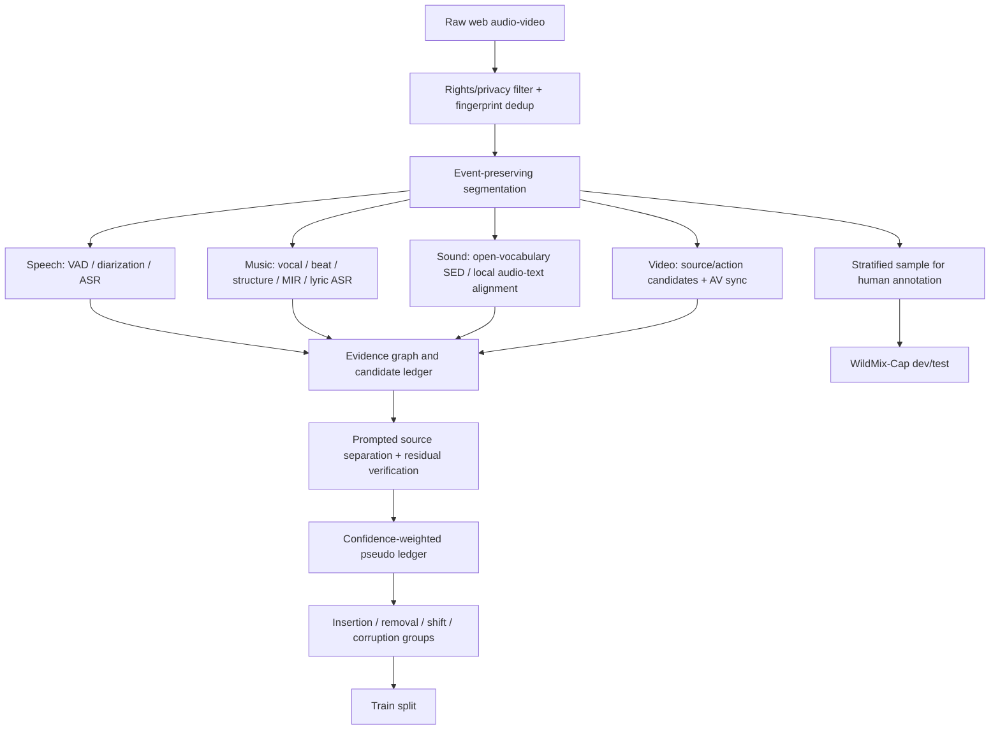

# 无标注互联网数据与 WildMix-Cap 基准

## 1. 原则：把 teacher 输出当证据，不当真值

现有 Bilibili、Instagram、TikTok 等视频没有 ground truth，但拥有三类可利用结构：原始声学混合、与声音弱同步的视频、可执行的反事实编辑。数据引擎应先保留多教师的原始结果、版本、置信度与相互矛盾，再形成事件候选；不要先让一个 LLM 把所有结果润色成一句无法追溯的 caption。

## 2. 数据处理总览



## 3. 入库、合规与去重

每个素材先记录：平台、原 URL/ID、上传者、抓取时间、可见许可、地域/语言、时长、codec、采样率、是否允许研究处理和再分发。涉及人声时增加隐私/敏感内容过滤；人脸和声音身份不作为对外标签。

建议的发布层级：

1. **可再分发媒体**：仅包含明确许可或团队自采/购买授权的波形；
2. **不可再分发媒体**：只发布 ID、时间段、派生事件标注和处理脚本，且确认平台条款允许；
3. **受限数据**：只能内部训练，不进入公开 benchmark；
4. **删除传播**：维护 source tombstone，原内容被删除或权利方请求移除时可追踪删除所有缓存和派生记录。

泄漏控制要早于切片：

- 对完整视频和音频做 perceptual hash/fingerprint；
- 聚合同一视频转载、同一歌曲/配乐、同一模板、同一上传者；
- train/dev/test 按 group 切分，而非按 20 s clip 随机切分；
- benchmark 对所有预训练/伪标注池做 fingerprint 检索；
- 单独保留整个平台作为 domain-shift test，可区分“内容泛化”和“平台 codec 泛化”。

## 4. Event-preserving segmentation

先用 frame-level speech/music/event activity 和 shot boundary 得到候选断点，再在 10-30 s 范围内选择尽量不切断强事件的窗口。保留前后各 1-2 s context；对跨窗口事件维护 global source ID 与 absolute time。固定 20 s 无重叠切块会产生断词、断歌词和错误事件边界，不应成为默认。

## 5. 多教师证据图

### 5.1 Speech branch

- VAD + overlapped-speech detector；
- diarization/EEND 或 MOSS-Transcribe-Diarize 类模型；
- 至少两个不同家族 ASR 的 transcript、word timestamp 和 token confidence；
- language ID、prosody 和 speaker embedding；
- 对重叠区保留多个 speaker lanes，不强行串成一个 transcript。

候选 speech 事件至少需要 VAD/diarization 与 ASR acoustic confidence 一致。仅有语言模型可读文本但局部声学置信低时标记为 `uncertain`。

### 5.2 Music and lyrics branch

- music/singing voice activity；
- vocal/accompaniment separation；
- beat/downbeat、tempo、key、instrument、section boundary；
- lyric ASR/forced alignment；
- music ALM 的全局与分段 caption。

`<lys>` 必须有 singing activity 与 vocal-stem 证据。若 lyric ASR 之间分歧大，只标注“演唱/哼唱”到 `<music>`，不输出具体歌词。歌词版权风险较高，公开集可以只保留短、必要的评价片段或受控/公共领域歌曲，并由法律/伦理流程确认。

### 5.3 General sound branch

- AudioSet taxonomy SED 产生高召回候选；
- FLAM/Detect Any Sound 类开放词汇模型产生局部时间相似度；
- LALM 生成描述属性，但不能单独决定存在性；
- energy/transient/repetition features 辅助切分；
- 对同义候选做 ontology linking，不用字符串相等合并。

### 5.4 Visual branch

- VLM 在 shot/track 级提出可见声源、动作和场景；
- lip motion、击打接触、乐器演奏等 AV sync 模型给同步分数；
- visual prompt 可交给 SAM Audio 产生目标 stem；
- off-screen sound 必须允许存在；visible-but-silent 必须成为 hard negative。

视频信息是训练时 privileged modality。最终 SceneLedger 的标准推理只输入音频；可另做 audio-visual 上界，但不能把它与 audio-only 主结果混在同一表格。

## 6. 候选保留与置信度

为每个事件保存 evidence graph：

```json
{
  "candidate": "glass breaking",
  "type": "sfx",
  "span": [4.6, 4.9],
  "support": {
    "open_vocab_sed": 0.91,
    "local_audio_text": 0.87,
    "visual_action": 0.54,
    "separated_stem_target": 0.83,
    "residual_leakage": 0.08
  },
  "teacher_disagreement": 0.12,
  "pseudo_weight": 0.78
}
```

建议规则：至少两个独立音频证据达到门槛；视觉只能加权不能单独入选；residual leakage 超阈值则不用于 removal consistency；时间边界取教师分布而非简单平均。模型训练使用连续 `pseudo_weight`，不是硬删除所有中等难度数据，否则会留下过于干净、不能代表复杂场景的样本。

## 7. CARC 反事实数据

### 7.1 可控变量

- 并发源数：1-6；
- source-to-background ratio：建议覆盖 -15 至 +15 dB；
- RIR/T60：从近无混响到约 1.2 s，并保留真实 room recordings；
- echo：单/多次、约 50-400 ms delay、不同衰减；
- 噪声：stationary、babble、traffic、wind、impulsive；
- codec：平台常见有损编码与多次转码；
- time shift：100 ms 网格内外均采样，用来检验插值和量化；
- source removal/insertion：优先真实 stems，其次严格过滤的 pseudo-stems。

这些范围是实验初始设计，不应在未查看数据分布前写死。最终采样应匹配真实爬取集的 SNR/T60/codec 统计，并额外保留 OOD 压力区间。

### 7.2 可听性门控

一个源在 mixture 中“数学存在”不等于人能听见。对每个 counterfactual view 估计局部 loudness/SNR、masking、separator judge 和小规模人类 audibility 标签，训练 audibility head。只有 audibility 超阈值才要求事件保持；阈值附近使用 soft target；不可听区要求置信下降，而不是要求模型超人检测。

## 8. WildMix-Cap benchmark

### 8.1 建议规模和构成

主版本目标 1,000 个 10-30 s 真实片段，先完成 200 条 pilot。建议分层抽样而不是自然比例抽样：

| Stratum | 目标数量 | 必含条件 |
|---|---:|---|
| 多说话人 | 250 | 2-4 speakers，至少一半含重叠说话，含远场/混响 |
| speech + music/sfx | 250 | speech 与背景音乐或显著 sfx 重叠；包含强弱遮蔽 |
| music + vocals/lyrics | 200 | 真歌曲/现场/短视频配乐，含伴奏、歌唱、可选 speech overlay |
| general polyphonic | 200 | 3 个以上事件、瞬态与持续事件共存 |
| 极端声学条件 | 100 | echo、强 reverb、wind/babble、低码率或设备失真；可与上面交叉 |

这里的数量总和是 primary stratum；每条还带多个交叉属性，最终报告也应按交叉条件分解。

### 8.2 标注界面与流程

标注器同时显示 waveform、log-mel、可变速播放和循环试听，但默认不显示模型预测，避免 anchoring。每条数据：

1. 标记可听 source lanes；
2. 标 event type、source/speaker ID、一个或多个 spans；
3. 写 transcript/lyrics/description；
4. 标 foreground/background、遮蔽、reverb/echo/noise 属性；
5. 分别给 onset/offset 的 earliest plausible、best、latest plausible；
6. 标 audibility 和语义置信；
7. 第二名标注者独立完成，第三人只裁决分歧。

对 speech/lyrics 可先显示多个 ASR 候选供**裁决阶段**使用，但第一遍独立听写不显示。音乐和 sfx 允许多个合理 paraphrases；评价时不要求唯一措辞。

### 8.3 0.1 s 标签的诚实定义

- 时间存储在 0.1 s 网格；
- 这只是 annotation/output resolution；
- 对冲击声可以有窄边界容忍；
- 对 fade、混响尾音、连续 ambience 使用 uncertainty interval；
- 报告标注者间 boundary MAE/IoU，作为模型上限背景；
- 只有模型 boundary error 接近或低于人工分歧时，才能讨论“100 ms-level accuracy”。

### 8.4 Split 和隐藏测试

- 200 pilot 只用于 schema/界面和初始诊断，不进入最终 test；
- 最终建议 200 public dev + 800 hidden test；
- 按源视频、上传者、fingerprint cluster、歌曲/节目/地点 group split；
- test 不交给任何 caption/teacher pipeline 做 pseudo-label；
- 公开 evaluation server 或加密 reference，防止反复人工调 test prompt。

## 9. 规范化数据记录

每条样本至少包含：

- `sample_id`, `source_group_id`, `duration_sec`, `platform`, `license_tier`；
- `events[]`，符合 schema；
- `acoustic_conditions`：noise、reverb、echo、codec、overlap_count 曲线；
- `annotation_provenance`：匿名 annotator IDs、版本、裁决；
- `boundary_uncertainty`；
- `rights/removal status`；
- 不对外发布的 `raw_source_uri` 与可公开的 `public_source_id` 分离保存。

## 10. 数据质量审计

每个数据版本发布前报告：

- 按 tag、语言、平台、场景、性别表现（若合规可标）、事件持续时间、重叠数的分布；
- missing-label audit：随机负查询与开放词汇复查；
- teacher agreement 与人工正确率的 calibration plot；
- separator target leakage/residual leakage；
- train-test fingerprint nearest-neighbor 距离；
- 双标一致性：type、span IoU、boundary MAE、speaker permutation、transcript WER；
- 被过滤和保留数据的差异，防止 confidence filtering 放大简单场景偏差。

