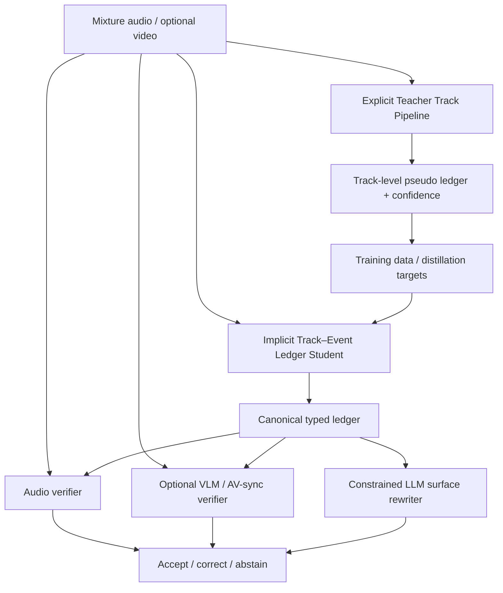

# Hybrid Track–Event Ledger：显式教师分轨与隐式学生分轨

> 本文是当前主 idea 的实现级定义。它吸收“先分轨再 caption”“AudioChat 式隐式声音分解”“TAC 式精确合成”“Audio-Omni 式真实/合成双支路”“可验证 RL”和“LLM/VLM 交叉验证”，但把它们放在不同职责与阶段中，避免一个不可训练、不可归因的巨型 agent pipeline。

## 1. 论文中心命题

**复杂音频 caption 的根本困难是 source attribution：模型必须先判断有多少个可听来源、每个来源何时活跃、它产生了哪些可描述事件，之后才应该生成文字。**

现有 timestamp-token LALM 通常直接学习：

$$
p(Y\mid x),
$$

其中 $x$ 是整段混合音频，$Y$ 是按时间排序的长文本。语义、来源和时间被压在一个自回归序列里；当多个声音重叠时，模型容易漏掉弱事件、重复解释同一事件，或者先生成合理文字再补一个时间。

我们改为显式潜变量分解：

$$
p(Y,Z,E\mid x)=p(Z\mid x)\,p(E\mid Z,x)\,p(Y\mid E,Z,x),
$$

其中：

- $Z$：source tracks，表示持续存在的来源/声道；
- $E$：caption events，表示由某个 track 产生的最小描述单元；
- $Y$：最终带 `<speech>/<lys>/<music>/<sfx>` 的序列化 caption。

训练时通过显式分轨教师和可控音频干预监督 $Z/E$；最终学生模型从 mixture 直接预测隐式 tracks，不要求推理时真的导出干净 waveform stems。

## 2. 关键术语

### 2.1 Source separation、diarization、SED 和 captioning 的区别

- **Source separation（声源分离）**：把 mixture waveform 分成若干 waveform stems，例如 vocals、music、speaker A、dog bark。它回答“声音信号如何拆开”。
- **Speaker diarization（说话人日志）**：回答“谁在什么时候说话”，输出 speaker labels 和 activity，通常不直接产生高质量转录。
- **Sound Event Detection, SED（声音事件检测）**：回答“什么事件在什么时候发生”，传统上使用封闭类别；open-vocabulary SED 使用文本 query。
- **Audio captioning**：生成自然语言描述。普通 AAC 通常只给 clip-level 一句话，未必知道每句话对应哪个来源。
- **Track**：本项目中指持续的 source lane，不要求一定能重建为完美 waveform。例如同一说话人在两个时间段出现，仍共享一个 track。
- **Event**：最小 caption unit。例如同一 speaker 的两句话是两个 events，但都指向同一 track。

### 2.2 显式分轨与隐式分轨

- **显式分轨**：输出 waveform stem 或 time-frequency mask，可单独播放。优点是可解释、每条 track 可交给专家模型；缺点是分离误差会级联，未知 source 数量难估计，运行成本高。
- **隐式分轨**：模型内部使用 learned queries/slots 表示不同来源，只输出 activity、source embedding 和 evidence mask，不一定生成可播放音轨。优点是端到端、适合 caption；缺点是需要强监督防止 slot collapse。

本项目采用 **teacher explicit / student implicit**：显式系统负责造数据、给伪标签和建立强 cascade baseline；最终 SceneLedger 学习隐式 tracks。

## 3. 与前置工作的关系

### 3.1 TAC 做了什么

TAC 使用 scene templates 从单源音频动态混合复杂场景，通过 RMS activity 得到精确时间，随机改变 style、merge threshold、activity threshold 和 resolution，再用 atomic timestamp tokens 与时间加权 CE 微调 Qwen2-Audio。它的优点是标签精确、实现直接；不足是来源主要来自合成混音，论文示例不允许 speech streams 互相重叠，speech transcript 还由外部 Whisper 后处理。

我们保留 TAC 的精确 renderer 和 B2 基线，但增加：

- 从真实互联网音频估计 scene prior，使合成分布贴近真实；
- speaker/vocal/music/sfx 真实重叠；
- track identity 和 event-to-track assignment；
- 真实背景上的精确 source injection；
- 隐式 track 学生，避免只学习按 onset 排序的文本。

### 3.2 AudioChat 做了什么

AudioChat 的 AudioCopilot 是一个 tool-calling LLM agent：先把文本 seed 扩写为完整场景，再为每个声音产生 caption、loudness、panning、start time，并调用 TTS/T2A 工具逐声渲染和混合。其 6M 多轮对话用于训练 AudioChat；Audio Transfusion Forcing 则联合 causal text LM loss 与连续音频 diffusion loss。

它说明“先把复杂场景分成独立声音再处理”是有效先验，但它主要从文本生成场景，并不意味着面对未知 mixture 时已经可靠恢复真实 tracks。我们的差别是：

- 任务是 mixture → evidence-grounded ledger，不生成音频；
- track 数量、activity 和文本必须由输入音频支持；
- agent 仅用于训练数据的语义规划和最终表面改写；
- 最终 source decomposition 由可训练 slot model 完成，而非把 agent 的 CoT 当作真值。

### 3.3 Audio-Omni 做了什么

Audio-Omni 的 AudioEdit 数据采用双支路：真实支路先由 MLLM 识别主要发声类别，再以 SAM Audio 抽取 target/residual，并用 VAD、CLAP 与人工抽检过滤；合成支路用 Scaper 构造精确 add/remove/extract。其报告从 540K 类别样本经过过滤只保留约 50K track pairs，说明真实分离数据必须高强度过滤。

我们借鉴双支路，但目标不是训练 editor，而是用编辑前后对形成 caption 的因果监督：被添加来源必须新增对应 event，被移除来源必须消失，其他 events 应保持。

### 3.4 SpotSound、AHA 和 TEMPO 的位置

- SpotSound 使用 positive/negative query 先判断事件是否存在，再定位时间，适合作为 per-track verifier；但它不知道完整场景中应该提出哪些 query。
- AHA 使用 counterfactual hard-negative preference data 抑制 event omission、false identity、temporal relation 和 quantitative temporal error，说明偏好对齐适合处理语言上合理但声学上错误的回答。
- TEMPO（匿名在审）先做 temporal SFT，再使用带可验证时间 reward 的 GRPO。它支持“RL 放在 SFT 之后”，但其任务仍以多个 prompt 分开，并非同一 mixture 的 track-event ledger。

## 4. 系统总览



系统提供四种运行模式：

1. `student-fast`：只运行学生模型，作为论文主模型和部署默认；
2. `student-audio-verified`：增加 FLAM/ASR/规则 verifier；
3. `student-av-verified`：有视频时增加 VLM 与 AV sync；
4. `teacher-agent`：完整显式分轨与专家模型，成本最高，用于数据生成和 topline。

论文必须分别报告四种模式，不能把闭源 VLM/LLM verifier 的收益算进 base model 而不披露。

## 5. 显式教师分轨系统

### 5.1 为什么不是“直接让分离模型输出 N 条轨”

未知真实音频没有给定 source count。通用 separator 通常需要固定最大源数、类别或文本/视觉 prompt；无条件地强制分成 $N$ 条会产生重复轨、空轨和混合残留。

因此教师系统采用 **propose → extract → caption → verify → stop**：

```python
candidates = proposer(audio, video=None)
tracks = []
residual = audio
for candidate in rank(candidates):
    target, new_residual = extractor(residual, prompt=candidate)
    evidence = verifier(target, new_residual, candidate)
    if evidence.accept:
        tracks.append(caption_expert(target, candidate))
        residual = new_residual
    if stopping_rule(tracks, residual, evidence):
        break
return tracks, residual
```

### 5.2 Candidate proposer

候选不是最终标签，而是供 separator/专家模型查询的 proposal：

- speech：VAD + WhisperX + pyannote diarization，得到 speaker lanes、word times；
- music/vocals：Demucs 得到 vocals/accompaniment，MIR/music captioner提出 instrument/genre/structure；
- sfx/ambience：MOSS 全局/分段 caption、FLAM/open-vocabulary SED、AudioSet classifier；
- video：VLM 提出可见发声物体，AV sync 判断其是否可能正在发声；
- ontology expansion：LLM 把粗类别扩展为 acoustic siblings，例如 `vehicle` → engine/horn/tire，但这些只作为 negative/query candidates。

所有候选统一成：

```python
Candidate(
    text: str,
    type_prior: Literal["speech", "lys", "music", "sfx"],
    time_prior: list[tuple[float, float]] | None,
    source_prior: str | None,
    proposal_scores: dict[str, float],
)
```

### 5.3 Track extractor

- speech：先用 diarization activity 切出 speaker-conditioned regions；需要重叠说话 waveform 时使用 speech separator；
- music：Demucs vocals/drums/bass/other；caption 任务第一版只保留 vocals/accompaniment 两级；
- arbitrary sfx：SAM Audio 接受 text、visual 或 time-span prompt，输出 target 与 residual；
- 不可分离但可定位事件：保留原 mixture 的 time mask，标成 `latent_track`，不伪造干净 waveform。

统一接口：

```python
TrackEstimate(
    waveform: Tensor | None,      # [C, N]
    residual: Tensor | None,
    tf_mask: Tensor | None,       # [F, T]
    activity: Tensor,             # [T100]
    source_embedding: Tensor,
    extraction_method: str,
)
```

### 5.4 专家 captioners

| Track type | 第一专家 | 第二证据 | 输出 |
|---|---|---|---|
| speech | WhisperX/MOSS ASR | diarization + language ID | transcript、word/utterance time、speaker |
| lys | vocals stem 上的 singing ASR/MOSS | accompaniment comparison、lyric presence | line text、line time、singer |
| music | MOSS/music captioner | tempo/instrument/structure MIR | music description、activity/section |
| sfx | MOSS/Audio Flamingo caption | FLAM/open-vocabulary SED | event phrase、spans、attributes |

LLM agent可以选择专家、拆分过长描述和规范词汇，但不能凭文本创建新 track。

### 5.5 轨道接受和停止规则

每条 track 至少计算：

- `reconstruction_error`：target + residual 是否接近输入；
- `target_support`：目标 caption 在 target 的局部 FLAM/embedding 分数；
- `residual_leakage`：目标 caption 在 residual 中是否仍然很强；
- `duplicate_score`：与已有 tracks 的 waveform/source embedding 相似度；
- `audibility`：目标对 mixture 的有效能量/SNR 与人类可听代理；
- `caption_agreement`：至少两个独立 teacher 是否语义兼容；
- `av_support`：可选，不能代替 audio support。

停止条件不是固定“找到 4 条轨”，而是：没有新的高置信 proposal、residual 只剩 diffuse background、候选与已有 track 重复，或达到安全上限 `K_teacher=12`。

## 6. 隐式 Track–Event Ledger 学生

### 6.1 为什么采用两级结构

原来的 flat event slots 对短 sfx 足够，但对多说话和歌词不够自然：同一 speaker 的多句话需要共享身份，同一 vocal track 的多句歌词也需要共享 singer。新版使用：

- `K_t=8` 个 **track slots**：持续来源；
- `K_e=24` 个 **event slots**：最小 caption units；
- 每个 event 预测一个 `track_pointer`，连接到某条 track 或 residual/background。

### 6.2 输入特征

```python
audio_data -> MOSS audio encoder
H_sem: [B, T80, Dm]             # 12.5-Hz semantic features
log_mel -> shallow TF encoder
H_tf:  [B, T100, Fp, Dt]        # time-frequency evidence
H_sem -> temporal fusion
H:     [B, T100, 768]
```

只使用 MOSS 的 1D temporal features 会丢失同时发生但频带不同的来源，因此加入轻量 TF evidence encoder。它可以是 4–6 层 ConvNeXt/Transformer，不从零承担语义理解；语义仍主要来自 MOSS。

### 6.3 Track slots

`K_t` learned queries 对 `H` 和 `H_tf` 做 cross-attention，输出：

```python
TrackSlotOutput(
    presence_logits: Tensor,     # [B, Kt]
    type_prior_logits: Tensor,   # [B, Kt, 4]
    activity_logits: Tensor,     # [B, Kt, T100]
    tf_mask_logits: Tensor,      # [B, Kt, T100, Fp]
    source_embedding: Tensor,    # [B, Kt, 256]
    audibility: Tensor,          # [B, Kt]
)
```

加入一个 residual slot，允许 diffuse noise 或无法归因内容存在。对非 residual slots 施加 soft mixture consistency：同一 TF bin 的 mask 总和接近 1，但允许重叠和不确定性，不使用严格 one-hot。

### 6.4 Event slots

event queries 同时读取全局时间特征和 track slots：

```python
EventSlotOutput(
    eventness_logits: Tensor,    # [B, Ke]
    type_logits: Tensor,         # [B, Ke, 4]
    track_pointer_logits: Tensor,# [B, Ke, Kt + 1]
    activity_logits: Tensor,     # [B, Ke, T100]
    boundary_params: Tensor,     # onset/offset distribution + uncertainty
    local_feature: Tensor,       # [B, Ke, 768]
    confidence: Tensor,          # [B, Ke]
)
```

event activity 应被其指向 track 的 activity 包含：

$$
L_{contain}=\sum_{i,t}\max(0, a^{event}_{it}-a^{track}_{q_i t}).
$$

这条约束能防止文本 event 出现在其声源不活跃的时间段。

### 6.5 Event text decoder

对有效 event：

1. 使用 event activity 与 track TF mask 从 `H/H_tf` 池化局部证据；
2. 投影为 4 个 local evidence prefix tokens；
3. 添加 type token、track source embedding 与最多 2 个 gated global tokens；
4. 共享 MOSS/Qwen3 decoder，使用 type-specific LoRA/adapters；
5. 所有 events 在 batch 维并行 teacher-forcing/decoding。

`<speech>` 和 `<lys>` 可以增加 CTC/monotonic alignment 辅助头，但主论文先要求 utterance/line 级 0.1 s，不把 word-level 100 ms 作为必达目标。

### 6.6 匹配与监督

先对 track slots 做 Hungarian matching：type、activity、TF mask、source embedding、audibility。再在 matched track 条件下匹配 events：type、track pointer、activity、boundary、text embedding。

总损失：

$$
L=L_{track}+L_{event}+L_{pointer}+L_{contain}+L_{text}+L_{evidence}+L_{CARC}+L_{cal}.
$$

显式教师样本按 confidence 加权；真 stems/程序合成权重最高，SAM Audio pseudo tracks 权重更低，纯 LLM/VLM proposal 不作为 positive mask 监督。

## 7. LLM 融合与重写

“用 LLM 把各轨 caption 重写成自然语言”是可行的，但必须锁定事实字段。推荐两层输出：

1. **Canonical ledger**：event ID、type、track ID、spans、原始 transcript/lyrics、confidence；这是评价与下游接口；
2. **Surface caption**：LLM 只允许改写每个 event 的描述和跨事件关系，不允许新增/删除 ID 或修改时间。

LLM 输入：

```json
{
  "locked_events": [
    {"id":"E1", "type":"sfx", "track":"T3", "spans":[[4.6,4.9]],
     "evidence_text":"glass breaking", "confidence":0.91}
  ],
  "allowed_operations":["paraphrase", "add_relation_between_existing_ids"],
  "forbidden_operations":["new_event", "change_time", "guess_hidden_words"]
}
```

输出必须引用既有 event IDs。重写后重新解析并比较 locked fields；任何变化直接回退到 deterministic serializer。论文主指标以 canonical ledger 为准，避免 LLM 文风影响事实评价。

## 8. 为什么预期优于单纯“分轨 + agent”

| 问题 | 纯显式 cascade | 纯自回归 TAC | Hybrid Track–Event Ledger |
|---|---|---|---|
| 分离误差 | 每一步级联，残留会污染 caption | 不分离，但重叠来源被压进文本 | 教师分离只作软监督，学生可利用 mixture context |
| 未知 source 数量 | 难，需要迭代停止 | 没有显式 source 计数 | track presence/null slots 学习可变基数 |
| 多说话身份 | diarization 可以，但跨专家融合复杂 | 通常只输出 speech 事件 | track identity 与 utterance event 分开 |
| 歌词/伴奏重叠 | Demucs 有帮助但残留明显 | 容易把歌词当 speech 或忽略 | vocal track + lyric events + music track |
| 0.1 s 时间 | 各专家时间标准不一致 | token 粒度精细但可能不准 | activity/boundary head 与不确定性 |
| 幻觉 | LLM fusion 可能新增内容 | language prior 直接支配 | 每个 event 必须指向 track 和局部 evidence |
| 推理成本 | 多模型、迭代分离、agent | 较低 | 学生较低；teacher/verifier 可选 |

## 9. 最小实现与完整实现

### Minimum Viable Research

- 显式教师：WhisperX + Demucs + MOSS + FLAM，不强制 SAM Audio；
- 学生：MOSS temporal features + track activity slots，不先做 TF mask；
- events：type/track pointer/activity/text；
- 数据：TAC-style + 真实背景 exact injection；
- 对齐：SFT + counterfactual preference；
- 验证：audio-only。

### Full paper

- SAM Audio arbitrary-source teacher；
- TF evidence mask distillation；
- audio editing model产生真实风格 add/remove/extract；
- DPO/GRPO；
- AV verifier 与音视频 caption；
- 1000 条 WildMix-Cap hidden test。

最小实现若已显著超过 B3，就足以证明核心结构；不要把 Audio-Omni、SAM Audio、VLM 和 RL 都变成方法成立的前置条件。

