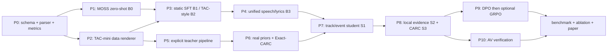

Exit code: 0
Wall time: 5.9 seconds
Output:
# 从零到投稿的逐步开发计划

> 直接回答：**第一个“大型复现模块”应当是 TAC 数据构造流程，但第一个代码 PR 不应直接开始批量混音。** 先用 2–3 天冻结输出 schema、parser/serializer、事件匹配指标和 MOSS zero-shot 接口；随后立刻实现 TAC-mini renderer。否则无法判断生成标签是否正确，也无法公平比较 B0/B1/B2。

## 1. 总体依赖关系



每一阶段都产出可运行 checkpoint 和独立实验行；不能等所有模块完成后才做第一次评估。

## 2. 建议仓库结构

```text
complex-audio-caption/
  configs/
    data/{tac_mini,tac_full,exact_carc,pseudo_tracks}.yaml
    model/{b0_moss,b2_tac,s1_slots,s2_evidence}.yaml
    train/{sft,dpo,grpo}.yaml
  schemas/
    track_event_ledger.schema.json
  src/sceneledger/
    data/
      schema.py
      manifests.py
      activity.py
      renderer.py
      exact_carc.py
      datamodule.py
    models/
      moss_adapter.py
      temporal_fusion.py
      track_slots.py
      event_slots.py
      evidence_pooler.py
      event_decoder.py
      serializer.py
    teachers/
      proposals.py
      separation.py
      speech.py
      music.py
      sfx.py
      verification.py
    losses/
      matching.py
      activity.py
      carc.py
      preference.py
    eval/
      parser.py
      event_matcher.py
      temporal.py
      speech.py
      hallucination.py
      robustness.py
    cli/
      render.py
      infer.py
      train.py
      evaluate.py
  tests/
    unit/
    integration/
    fixtures/
  third_party/
    README.md                 # 只记录 pin/安装方式，避免无意复制权重
  reports/
    data_cards/
    experiment_cards/
```

Python package 使用 `src` layout，配置可用 Hydra/OmegaConf；训练框架优先复用 MOSS-Audio 官方代码习惯，不为“框架统一”重写其模型主干。

## 3. P0：协议、解析器和指标（2–3 天）

### 目标

冻结 `schema v0.2`，使所有 baseline 和主模型输出同一 canonical ledger。

### 实现任务

1. `schema.py`：Pydantic/dataclass 定义 track、event、span、confidence、provenance；
2. `serializer.py`：ledger ↔ XML-like tagged caption；
3. `parser.py`：容错解析模型字符串，但评估时记录严格格式成功率；
4. `event_matcher.py`：按 type、时间、语义和 track pointer 做 Hungarian matching；
5. `temporal.py`：tIoU、onset/offset MAE、容差准确率、multi-span；
6. 20 个手工 fixtures：重叠 speech/music/sfx、歌词、回声、多段事件、空场景、边界越界。

### CLI

```bash
python -m sceneledger.cli.evaluate \
  --prediction tests/fixtures/predictions.jsonl \
  --reference tests/fixtures/references.jsonl \
  --output reports/p0_metrics.json
```

### 验收

- JSON Schema、Python object 与文本序列化 round-trip；
- 同一 event 顺序变化不改变 set metric；
- 边界量化误差测试覆盖 0.05/0.1/0.25 s；
- 非法 ID、负时间、end < start、重复 event 被明确拒绝；
- 所有 metric 有 toy case 手算值。

## 4. P1：开源底座与 B0（2–4 天，可与 P2 并行）

### 底座决定

以 [MOSS-Audio](https://github.com/OpenMOSS/MOSS-Audio) 为主底座：其 4B 开放模型已经统一处理 speech、sound、music，并提供 LoRA 路径；适合在同一 decoder 中生成四类标签。先 pin 官方 commit、记录模型权重版本和许可证。

SAM Audio 是 P5/P6 的可选 teacher，不是学生主干，也不是复现开始条件。若权重申请或许可证阻塞，MVP 使用 WhisperX/pyannote、Demucs、MOSS/FLAM 组合。

### 实现任务

- 写 `moss_adapter.py`，完成 waveform→prompt→raw text；
- 为 B0 设计不超过 3 套 frozen prompt，不在测试集上反复 prompt tuning；
- parser 将 B0 输出映射成 ledger；不能解析的样本保留为 format failure；
- 记录显存、real-time factor、最大输入长度和音频采样率。

### 验收

20 个 fixture 全部可推理；200 条 pilot 有完整 prediction JSONL；格式成功率、四类 recall、幻觉率和时间指标均有结果。B0 差并不是失败，它是后续增益的锚点。

## 5. P2：TAC-mini 数据构造复现（第 1 周）

### 为什么此时优先做数据，而非先写 slots

track/event slots 需要可控来源数、活动掩码和 source identity。没有 renderer，模型结构无法被单元验证；直接用 web pseudo labels 会让“结构错误”和“标签错误”无法区分。因此 P0/P1 后的第一主线就是数据。

### 第一版只做 500 条

数据源先用许可清晰的小规模 speech、music、sfx 单源，不追求百万规模。实现：

- 3 类 TAC 模板：speech+music、music+sfx、speech+music+sfx；
- 允许重叠，但先保持单 speaker；
- RMS/activity segmentation、随机 placement、gain、fade、merge threshold；
- atomic 0.1 s timestamp target；
- 每条 source、变换、采样点级起止、seed 写入 manifest；
- 保存 mixture 与可选 stems，用于重构测试。

### CLI 契约

```bash
python -m sceneledger.cli.render \
  --config configs/data/tac_mini.yaml \
  output_dir=data/derived/tac_mini

python -m sceneledger.data.validate \
  --manifest data/derived/tac_mini/manifest.jsonl \
  --listen-list reports/tac_mini_listen.csv
```

### 验收

- 同一 seed 的 waveform hash 一致；
- manifest 能恢复精确源文件区间和所有变换；
- stems 求和与 mixture 的差异符合后处理定义；
- 50 条人工试听中没有明显标签错位；
- renderer 速度、磁盘占用和失败率已测量。

通过后扩到 10k，而不是直接 100k。

## 6. P3：B1 与 B2（第 2–3 周）

### B1：Static SFT

将固定混音及 caption 预先保存，训练 MOSS LoRA。这一行隔离“普通 SFT 收益”。

### B2：TAC-style paper-spec reimplementation

按 TAC 论文规格实现：动态 mixer、style/resolution/activity 随机化、atomic timestamps、time-weighted CE、多任务 prompt。因为 TAC 官方训练代码/checkpoint/原始许可数据未完全开放，结果写作必须称 `paper-spec reimplementation`，不能称 exact reproduction。

### CLI

```bash
python -m sceneledger.cli.train --config configs/model/b1_static_sft.yaml
python -m sceneledger.cli.train --config configs/model/b2_tac.yaml
python -m sceneledger.cli.evaluate \
  --checkpoint outputs/b2_tac/best \
  --suite configs/eval/pilot.yaml
```

### 验收与决策

- B2 在 synthetic hold-out 的 event/time 指标超过 B1；
- 如果只在 synthetic 上提升而真实 200 条下降，先修 renderer/domain gap，不进入大模型结构；
- 保存 exact prompt、timestamp vocabulary、loss weights、训练 token 数与随机 seed。

## 7. P4：B3 统一 speech/lyrics 基线（第 3–4 周）

B2 仍可能像 TAC 一样把 speech transcript 交给外部 ASR。B3 必须在同一输出中生成：

- `<speech>`：speaker ID、utterance time、verbatim transcript；
- `<lys>`：singer ID、line time、可辨识歌词；
- `<music>`：伴奏/整体音乐；
- `<sfx>`：非语音声音。

数据增加 overlapping speakers、vocals+accompaniment 和 speaker turns。暂不承诺 word-level 0.1 s；主目标是 event/utterance/lyric-line 级。报告 speaker-attributed WER 和 lyrics line error。

验收：同一 serializer 下 B3 比“B2 + 外部 Whisper 拼接”减少冲突/重复，并建立主模型 S1 的直接 autoregressive 对照。

## 8. P5：显式教师 v0（第 4–5 周）

### MVP 组件

```text
speech: WhisperX + pyannote/VAD
music/vocals: Demucs
global/track caption: MOSS-Audio
sfx proposal/verification: FLAM 或开放词汇 SED
fusion: deterministic ledger builder
```

先不接 SAM Audio 和 LLM agent。对 100 条真实复杂片段输出：候选列表、track activity、专家 caption、置信度、拒绝原因和 residual。

### Topline 实验

在人工 pilot 上比较：

- mixture 直接 B3；
- oracle stems→专家 caption；
- predicted stems→专家 caption；
- predicted stems+mixture context→专家 caption。

这个实验极其关键：它量化分轨的理论收益和分离级联损失。如果 oracle stems 都没有收益，track idea 需重审；如果 oracle 很强而 predicted 很差，重点应转向隐式 slots/teacher filtering，而不是继续堆 agent。

## 9. P6：真实分布与 Exact-CARC（第 5–7 周）

### P6a 场景先验

在合规的 web 池上只估计低维分布：并发来源数、类型共现、SNR、持续时间、speech/music overlap、T60/codec/domain。人工复核 500 条以校准弱教师。

### P6b TAC++

加入 source-specific RIR、echo、distance、ducking、occlusion、设备响应、codec 和更真实的 scene graph。用 synthetic detector 和分布报告检查捷径。

### P6c Exact-CARC

真实背景 `x` + 已知 source `s` 生成 add/remove/shift/degrade pairs，只监督差分。先做 5k–10k 对验证闭环，再扩到 50k–100k。

### 可选 P6d pseudo tracks

接入 SAM Audio：proposal→extract→target/residual verification。人工 200 条必须达到 precision-first 目标后才进入训练；不影响主线时程。

## 10. P7：S1 Track–Event slots（第 7–9 周）

按可诊断顺序实现：

1. `S1a event-only`：24 event slots，type/activity/boundary，无 text；
2. `S1b track-only`：8 track slots，presence/type/activity；
3. `S1c pointer`：event 指向 track，加 containment loss；
4. `S1d identity`：speaker/singer/source embedding；
5. `S1e text`：局部池化后 event caption。

每步都在 TAC-mini 上先 overfit 32 条样本，再跑 500/10k 数据。常见 bug：Hungarian cost 尺度不平衡、null slot 占满、activity 全零、所有 events 指向同一 track、重复 caption。

### 最低通过线

- 32 条过拟合集接近完美匹配；
- source-count MAE 优于用 B3 caption 反解析计数；
- overlap subset 的 event recall 提升；
- pointer accuracy 在 oracle tracks 和 predicted tracks 下分别报告；
- 没有依靠固定 slot index 学类别的现象，打乱 target 顺序结果不变。

## 11. P8：S2 局部证据与 S3 CARC（第 9–11 周）

### S2

加入浅层 TF encoder、track mask、local evidence prefix、inside/outside contrastive loss。比较：

- global audio only；
- time-mask local pooling；
- TF-mask local pooling；
- local + gated global。

### S3

加入 Exact-CARC paired batch 和 delta losses。主检验不是 synthetic 分数，而是 WildMix pilot 上：弱/重叠事件 recall 上升，同时 hallucination 不上升；source removal sensitivity 提高。

Go/no-go：若 S3 仅提高 injected-event 指标而真实人工集无收益，检查 audibility gate、注入 source 域差异和 preservation loss，而不是直接扩数据。

## 12. P9：DPO 与可选 GRPO（第 11–13 周）

先生成 hard-negative audit set，确认每类 negative 的正确性，再训练 DPO。只有满足下列 gate 才做 GRPO：

- schema 合法率 >99%；
- reward 各分项在人工集上方向正确；
- reward 与人工偏好显著相关；
- SFT/DPO 输出 event count、长度和 abstain 稳定；
- 有足够算力做多样本采样与回滚。

GRPO 失败的默认处理是回到 DPO，不把 RL 作为论文必须项。论文可把“可验证 reward 作为评价器/数据过滤器”保留，即便在线 RL 没有稳定收益。

## 13. P10：LLM/VLM 验证与 AV 扩展（第 12–14 周）

按以下顺序接入：

1. 规则/schema verifier；
2. audio support/ASR/FLAM verifier；
3. LLM 只做去重、逻辑与受限改写；
4. VLM 提供 source identity 与 AV sync；
5. accept/correct/abstain 决策；
6. verified outputs 蒸馏回 student。

报告 `student-fast`、`audio-verified`、`AV-verified`、`teacher-agent` 四种计算模式。闭源 verifier 必须标出模型、日期、调用成本与是否进入最终指标。

## 14. Benchmark 与投稿实验（持续，最终 4–6 周）

### WildMix-Cap

- pilot：200 条，用于迭代但不反复训练调参；
- dev：约 500 条；
- hidden test：约 1000 条，双人标注+仲裁；
- strata：并发来源数、overlap ratio、SNR、T60、echo、多说话、lyrics、music+sfx、画外音；
- 保存边界 uncertainty 与 not-describable/inaudible 决策。

### 主表

`B0/B1/B2/B3 → S1 → S2 → S3 → +DPO → +GRPO → +AV verifier`，每行报告：

- semantic-temporal event F1；
- onset/offset MAE 与 tolerance accuracy；
- speech SA-WER、lyrics error；
- hallucination/omission；
- source-count MAE、pointer accuracy；
- risk-coverage/calibration；
- 随 overlap/SNR/T60/source count 的曲线；
- 参数、训练 GPU-hours、推理 RTF。

### 论文最小成立条件

即使不使用 SAM Audio、音频 editor、VLM 和 RL，以下结果也应构成完整论文：

1. B2 paper-spec reproduction 与强 B3；
2. Hybrid Track–Event Ledger 在复杂真实集显著优于 B3；
3. local evidence 降低 hallucination；
4. Exact-CARC 比等量 pseudo-label SFT 更有效；
5. 新 benchmark 和细分评价揭示现有模型在 overlap/混响/多说话上的失败。

## 15. 第一周可直接执行的 issue 列表

### Day 1–2

- `I001` 建 Python package、CI、lint/test；
- `I002` 实现 v0.2 schema/Pydantic object；
- `I003` parser/serializer round-trip；
- `I004` event matcher 与 toy metrics。

### Day 3

- `I005` pin MOSS-Audio 环境与 checkpoint；
- `I006` B0 inference adapter；
- `I007` 建 20 条 fixtures 和 20 条真实 smoke clips 索引。

### Day 4–5

- `I008` source loader/activity extraction；
- `I009` TAC-mini scene graph sampler；
- `I010` renderer + manifest + deterministic replay；
- `I011` 生成并人工试听首批 50 条。

### Day 6–7

- `I012` 扩到 500 条并跑 validator；
- `I013` B1 LoRA 单 batch overfit；
- `I014` 发布第一份 data card 与 B0 report；
- `I015` 根据试听错误冻结 TAC-mini v0.1。

所以，对“首先是否复现数据构造流程”的精确回答是：**先用极短的 P0/P1 建立尺子，然后首先复现 TAC-mini 数据构造；不要先复现 TAC 的大规模训练，也不要先接复杂 agent。**

## 16. 项目决策会议需要确认的事项

以下问题会实质改变实现，应由团队尽早拍板：

1. 主论文是否承诺 verbatim speech/lyrics，还是只描述其存在和内容摘要；前者需要更强数据许可与转录评价；
2. 目标音频最长 20 s、30 s 还是 60 s；它决定 slot 数、显存、事件密度和 benchmark；
3. 现有 web 数据的规模、语言分布、视频是否保留、平台许可和可否人工标注；
4. 可用 GPU 型号/数量和单次训练预算；决定 4B 全参、LoRA、离线 feature cache 或蒸馏；
5. SAM Audio 权重是否可取得且许可证是否允许论文训练；
6. 主要投稿窗口与时间；决定 full paper 还是 MVP；
7. 测试集是否允许发布音频，若不允许则发布 ID/时间段、特征和评测服务器。


