# 数据构造流程盘点与开源数据集扩充方案

> 核查日期：2026-08-16 | 依据：仓库实测（`ls` / `wc -l` / 源码阅读）+ 外部检索
> 关联：`docs/03`（数据与基准）、`docs/22`（v6k review）、`docs/23`（会议对齐）
> 结论先行：**当前存在两套互不相通的数据流水线；正式渲染器结构完备但喂的是合成占位音频，真实素材脚本素材真实但结构退化。扩充的第一步不是下载更多数据，而是把已实现的 `FileSourcePool` 接上真实素材。**

---

## 1. 当前数据构造流程全景

### 1.1 两套流水线并行且未打通

```mermaid
flowchart TB
    subgraph A["流水线 A：包内正式渲染（结构完备 / 音频假）"]
        A1["configs/data/*.yaml<br/>pool.kind = synthetic"] --> A2["SyntheticSourcePool<br/>正弦/和弦/噪声爆发"]
        A2 --> A3["SceneGraphSampler<br/>13 个场景模板"]
        A3 --> A4["renderer.py<br/>RIR/echo/gain/fade"]
        A4 --> A5["activity.py → schema.Ledger"]
        A5 --> A6["manifest.jsonl + 3 道 gate"]
        A6 --> A7["datamodule → 训练"]
        A8["FileSourcePool<br/>已实现，从未启用"] -. "config 里被注释" .-> A3
    end
    subgraph B["流水线 B：scripts 真实混音（音频真 / 结构退化）"]
        B1["download_sources.py<br/>download_music.py"] --> B2["/tmp/real_audio"]
        B2 --> B3["setup_esc50.py<br/>extract_sources.py"]
        B3 --> B4["build_real_mix_v2..v7.py<br/>硬编码 /tmp"]
        B4 --> B5["MOSS 逐源实听 caption"]
        B5 --> B6["manifest.jsonl<br/>无 hash / 无源路径"]
        B6 --> B7["convert_v6*_manifest.py"]
        B7 --> B8["训练 / eval_heldout.py"]
    end
```



**两套的能力恰好互补，但没有任何一条边把它们连起来。** 这是当前数据问题的总根源。

### 1.2 流水线 A：包内正式渲染

入口：`python -m sceneledger.cli.render --config configs/data/X.yaml --output-dir ... [--validate]`

- **模板**：`scene_graph_sampler.py:34` 定义 13 个 `TemplateID`
  基础 6 个：`isolated_sfx` / `speech_over_music` / `music_with_sfx` / `speech_music_sfx` / `repeated_event` / `ambient_with_intermittent_sfx`
  B3 扩展 3 个：`lyrics_over_music` / `speech_music_lyrics_sfx` / **`overlapping_speakers`（S1+S2 双说话人）**
  复杂 3 个：**`complex_cocktail`（3–4 说话人 + 音乐 + sfx）** / `rich_band`（5 源）/ `multi_event_dense`（4–5 源）
  消融 1 个：`random_mix`
- **source kind**（`FileSourcePool.by_kind` 的键）：`speech` / `vocal` / `music` / `sfx` / `ambience` 共 **5 类**
- **声学条件**：`Conditions` 结构体已含 `noise_snr_db` / `echo_delay_ms` / `echo_atten_db` / `t60_sec` / `codec` / `overlap_ratio`
- **三道 gate**：同 seed 重放 hash 一致 / stems 求和 == dry_mixture / ledger schema 校验
- **防泄漏**：`group_split()` 按"源路径集合 sha1"分组，`subgroup_count: 5`

### 1.3 流水线 B：scripts 真实混音

`build_real_mix_v7.py`（最新，2026-08-16 seed）已修 `docs/22` 的问题 25–29：

| 修复 | 实现位置 |
|---|---|
| S 时间戳：改用**混音后 RMS 实际活跃区间** | `compute_rms_activity()`，50 ms 帧、阈值 0.005、<0.1 s 间隙合并 |
| T caption：增强 prompt | `"Describe ALL audible events in this audio in detail..."` |
| U 场景合理性：**每个场景限定 ESC-50 类别子集** | `SCENE_TEMPLATES` 12 个场景，每源带 `esc50_cats` 白名单 |
| V 人声质量：压缩 + EQ | `apply_compression()` + `apply_vocal_eq()` |

还有 ducking（语音时其他源压 6–8 dB）、合成 RIR（p=0.4, T60 0.2–0.8 s）、峰值归一化。

---

## 2. 实际使用的开源数据集（实测确认）

### 2.1 真正进入训练数据的只有 3 个

| 数据集 | 用法 | 实际用量 | 脚本位置 |
|---|---|---|---|
| **ESC-50** | sfx + ambience 源 | v6 仅 **17/50 类**；v7 扩到约 **30 类**（新增 rain/thunderstorm/clock_alarm/clock_tick/keyboard_typing/mouse_click/sneezing/hand_saw/crushing/cow/door_wood_creaks 等） | `setup_esc50.py`（分 sfx/ambience 两桶 + 生成 `esc50_category_map.json`） |
| **GTZAN** | music 源 | 仅 **classical / jazz / blues** 三个 genre（约 300 首 → v6k 产出 music 566 事件） | `download_music.py` → `marsyas/gtzan` |
| **MOSS demo assets** | speech 源 | **仅 2 个 mp3**：`test_en.mp3`（英语）、`faker_and_chovy.mp3`（韩语） | `build_real_mix_v7.py:103-106` |

> `build_real_mix_v7.py:103` 的 `SPEECH_SOURCES` 只有 2 条，且**未接 LibriSpeech**。v6k 的 260 条 speech 事件全部来自这 2 个文件的随机截段——这就是 `MEMORY.md` 中"F1 0.970 只证明同素材不同随机组合泛化"的直接来源。

### 2.2 已下载但闲置的存量

| 数据集 | 规模 | 下载脚本 | 当前状态 |
|---|---|---|---|
| **LibriSpeech dev-clean** | 270 speakers / 5.4 h / **带转录** | `download_sources.py:8` | v3 用过，v6/v7 弃用。**唯一能支撑多说话人 + verbatim ASR 的源** |
| **MUSDB18** | 150 首 / 含 vocals+drums+bass+other 分轨 | `download_music.py:10` | **从未使用**。唯一能同时支撑纯器乐 + 歌词轨 + CARC 真分轨 |
| **UrbanSound8K** | 8732 条 / 10 类 | `download_sources.py:46` | `extract_sources.py` 每类只抽 20 条且 `break` 在第一个 shard |
| **FMA small** | 8000 首 | `download_sources.py:32` | `extract_sources.py:36-48` 只打印列名，**从未真正抽取** |

### 2.3 合成占位池（流水线 A 唯一实际使用的"源"）

`SyntheticSourcePool`（`scene_graph_sampler.py:208`）程序生成：

| 方法 | 生成内容 |
|---|---|
| `_synth_speech` | 共振峰式音调 + 音节包络（**不是真实语音**） |
| `_synth_vocal` | 带颤音与呼吸包络的持续音 |
| `_synth_music` | 慢速和弦进行（根音 + 五度 + 八度） |
| `_synth_sfx` | 快衰减瞬态噪声爆发 |
| `_synth_ambience` | 雨/风/室内底噪床 |

这正是 `docs/16` 判定"合成语音是正弦波、人耳无法辨认"的代码来源。

### 2.4 已构造数据实测清单

```
data/derived/b2_no_template/   audio=500  manifest=500   合成
data/derived/b3_5k/            audio=5000 manifest=5000  合成
data/derived/b3_unified/       audio=500  manifest=500   合成
data/derived/tac_mini/         audio=500  manifest=500   合成
data/derived/b3_v2/            audio=0    manifest=5000  ← 音频缺失
data/derived/real_mix/         audio=0    manifest=200   ← 音频缺失
data/derived/real_mix_v2/      audio=10   manifest=200   ← 音频缺失
data/derived/real_mix_v3b/     audio=200  manifest=200   真实
data/derived/real_mix_v4/      audio=200  manifest=200   真实
data/derived/real_mix_v5/      audio=200  manifest=200   真实
data/derived/real_mix_v6/      audio=200  manifest=200   真实 ← 61MB，唯一完好
data/derived/real_mix_v6_1k/   audio=0    manifest=1000  ← 最好成绩，音频已丢
```

### 2.5 【紧急】素材池当前状态：全空

```
/tmp/real_audio      → No such file or directory
/tmp/real_mix_v*     → No such file or directory
/tmp/moss_weights    → No such file or directory
```

**后果**：`build_real_mix_v7.py` 现在**根本无法运行**——它在 `:214` 读 `/tmp/moss_weights`、`:218` 读 `/tmp/real_audio/esc50_category_map.json`、`:93` 扫 `/tmp/real_audio/gtzan/genres/`。v7 脚本已写好但从未成功执行，`data/derived/` 下没有 `real_mix_v7`。

→ **任何造数工作的第一步是重建素材池到工作区内持久路径，而不是下载新数据集。**

---

## 3. 三个结构性诊断结论

### 3.1 v7 只修了"表面质量"，没修"结构缺口"

`docs/22` 的问题 25–29 是**质量**问题（时间戳偏移、caption 不详、场景不合理、人声差），v7 已修。但 `MEMORY.md` 中 P0 列的**结构**问题，v7 一条都没修：

| 结构缺口 | v7 现状 | 代码证据 |
|---|---|---|
| 同源多事件（pointer 训练信号） | 仍 1:1 双射 | `:316-320` 每个 source 造一个 event，`track_id = f"T{sc_idx+1}"` |
| 多说话人重叠 | 场景模板中**无任何双 speech 场景** | `SCENE_TEMPLATES` 里 speech 只出现在 `speech_with_music` / `speech_with_sfx`，各 1 个 |
| `lys` 歌词轨 | 完全不存在 | `etype` 只可能是 `music`/`speech`/`sfx`（`:315`） |
| 多 span 重复实例 | 每事件仅 1 span | `:318` `"spans": [{...}]` 单元素 |
| `conditions`/`audibility`/`boundary_uncertainty` | 全部不写 | ledger 只有 `tracks`/`events`/`provenance` |
| 源溯源与 group split | 不记 `source_path`/`sha256` | `sources_info` 只有 role/type/onset/offset/caption/gain |
| `n_sources` 范围 | 2–3（模板固定） | 12 个模板中 2 源的 3 个、3 源的 9 个 |

### 3.2 关键发现：需要的结构，流水线 A 已经全部实现了

对照上表，**流水线 A 的 `scene_graph_sampler.py` 已经具备**：
- `overlapping_speakers`（S1+S2）与 `complex_cocktail`（3–4 speakers）→ 多说话人
- `lyrics_over_music`、`speech_music_lyrics_sfx`、`rich_band` → `vocal` kind → `lys` 事件
- `repeated_event` → 多 span 重复实例
- `Conditions` 完整结构体 → 分层评测
- `group_split()` 按源 sha1 分组 → 防泄漏
- 三道 gate → 可复现

**唯一缺的是真实音频。而 `FileSourcePool` 已经实现好了（`scene_graph_sampler.py:183-205`），只是所有 config 里 `file_pool` 被注释掉。**

→ **正确路线不是写 `build_real_mix_v8.py`，而是给 `FileSourcePool` 填真实素材路径。** 这一步能同时拿到：真实音频 + 完整结构 + 三道 gate + 防泄漏切分。这是投入产出比最高的动作。

### 3.3 素材池与研究缺口的映射

`FileSourcePool` 需要 5 类键，当前可用素材严重偏斜：

| kind | 当前素材 | 缺口 |
|---|---|---|
| `speech` | 2 个 mp3 | **需多说话人、带转录、有重叠** |
| `vocal` | **无** | **`lys` 完全无源** |
| `music` | GTZAN 3 genre（34.6% 含人声） | 需**纯器乐**（分轨 accompaniment） |
| `sfx` | ESC-50 约 30 类 | 需更多类别与真实录音 |
| `ambience` | ESC-50 rain/wind/crickets 等 | 需真实长时环境录音 |

---

## 4. 可扩充的开源数据集（按缺口分组）

以下按"能解决哪个缺口"组织。**优先级 P0 = 直接解锁当前卡住的研究问题**。

### 4.1 `speech`：多说话人 + 重叠 + 带转录（P0，解锁 RQ1/RQ6）

| 数据集 | 规模 | 关键价值 | 许可 | 下载 |
|---|---|---|---|---|
| **LibriSpeech** | dev-clean 5.4 h/270 spk；train-clean-100 100 h；全量 1000 h | 干净单说话人 + **verbatim 转录**，多说话人靠混合构造 | CC BY 4.0 | `https://www.openslr.org/12/`；HF `openslr/librispeech_asr`（**已下载过**） |
| **AMI Meeting Corpus** | 100 h 真实会议，含**自然重叠** + diarization + 转录 | 真实重叠说话，非人工混合 | CC BY 4.0 | `https://groups.inf.ed.ac.uk/ami/download/` |
| **LibriCSS** | 10 h，LibriSpeech 重放录制，**0%–40% 重叠率分档** | 重叠率是显式受控变量，天然适配分层评测 | MIT | `https://github.com/chenzhuo1011/libri_css` |
| **AISHELL-4** | 120 h 中文会议，8 通道，含重叠标注 | 中文 + 远场 + 重叠 | Apache 2.0 | `https://www.openslr.org/111/` |
| **AliMeeting** | 120 h 中文会议（M2MeT 挑战赛） | 同上 | 研究用 | `https://www.openslr.org/119/` |
| **VoxCeleb1/2** | 1251/6112 speakers，野外采集 | speaker identity 多样性极高，适合 source embedding | CC BY 4.0（需申请） | `https://www.robots.ox.ac.uk/~vgg/data/voxceleb/` |
| **CHiME-6** | 真实家庭聚会，多说话人 + 强噪声 | 极端退化条件 | 研究用（需注册） | `https://chimechallenge.github.io/chime6/` |
| **LibriheavyMix** | 20000 h 远场重叠合成 | 规模化预训练（可选） | CC BY 4.0 | HF 搜 `LibriheavyMix`（**需核实**） |

**建议**：P0 只接 **LibriSpeech train-clean-100（多 speaker 池）+ AMI（真实重叠）+ LibriCSS（重叠率分档）** 三个。AMI 与 LibriCSS 是把"多说话人重叠"从人工混合升级为真实录音的关键。

### 4.2 `vocal`：歌声 + 歌词对齐（P0，解锁 `lys` 从 0 到有）

| 数据集 | 规模 | 关键价值 | 许可 | 下载 |
|---|---|---|---|---|
| **MUSDB18-HQ** | 150 首，**vocals 分轨独立** | vocals 直接作 `vocal` 源，other 作纯器乐 `music` 源，**一份数据同时补两个缺口** | CC BY-NC-SA 4.0 | `https://zenodo.org/records/3338373`；HF `salu133445/musdb18`（**已下载过**） |
| **DALI v2** | 5358 首，**音频-歌词-音符时间对齐**（line + word 级） | 唯一大规模歌词时间戳。注意只发布标注 + YouTube ID，音频需自行获取 | 标注 CC BY-NC-SA | `https://github.com/gabolsgabs/DALI`；Zenodo `records/2577915` |
| **jamendolyrics** | 79 首，**word 级时间对齐**，多语言 | 音频可直接下载（Jamendo CC），最适合做 `lys` 的干净评测集 | CC（各曲不同） | `https://github.com/f90/jamendolyrics`；HF `jamendolyrics/jamendolyrics` |
| **MoisesDB** | 240 首 / 45 艺术家，**11 类细分 stem** | 比 MUSDB18 更细的分轨，vocals 单独 | 研究用（需注册） | `https://music.ai/research/`；HF `wearemusicai/moisesdb` |
| **MedleyDB** | 122+196 首多轨 + 旋律标注 | 含 vocal activation 标注 | CC BY-NC-SA | `https://medleydb.weebly.com/`（NYU MARL） |
| **MIR-1K** | 1000 片段，**人声/伴奏左右声道分离** | 极易用：直接取左右声道 | 研究用 | `https://sites.google.com/site/unvoicedsoundseparation/mir-1k` |
| **Opencpop / M4Singer / OpenSinger** | 中文歌声，带音素时间标注 | 中文 `lys` | CC BY-NC-SA | HF 搜对应名；见 `open-mmlab/Amphion` 的 Sing-0.4k 清单 |

**建议**：P0 用 **MUSDB18-HQ**（已下载，零成本，一份补两缺口）+ **jamendolyrics**（79 首但 word 级对齐，作 `lys` 评测金标准）。DALI 作为 P1 扩量，注意其音频获取的合规问题（`docs/03 §3` 的许可分层）。

### 4.3 `music`：纯器乐（P0，修 34.6% 人声污染）

| 数据集 | 规模 | 关键价值 | 许可 | 下载 |
|---|---|---|---|---|
| **MUSDB18-HQ 的 `other`+`drums`+`bass`** | 150 首 | **保证零人声**（vocals 已被剥离），直接消灭 34.6% 污染 | CC BY-NC-SA | 同上 |
| **Slakh2100** | 2100 首合成多轨（MIDI 渲染），145 h | 有**完美 MIDI 对齐时间标签** + 逐乐器分轨，是 CARC 真分轨监督的理想源 | CC BY 4.0 | `https://zenodo.org/records/4599666` |
| **MTG-Jamendo** | 55000 首，含 instrumental 标签 | 可按 `genre/instrument/mood` 筛纯器乐，规模大 | CC | `https://github.com/MTG/mtg-jamendo-dataset` |
| **FMA (full/large)** | 106574 首 + 元数据 | 规模化 + genre 元数据 | CC（各曲不同） | `https://github.com/mdeff/fma`（**已下载 small，但从未抽取**） |
| **MedleyDB** | 同上 | 含 instrumental-only 曲目 | CC BY-NC-SA | 同上 |

**建议**：P0 立即用 **MUSDB18-HQ accompaniment** 替换 GTZAN。这是 `docs/21` 那个错误结论（"音乐源问题已解决"）的真正解法。**Slakh2100** 优先级紧随其后，因为它是 RQ5（CARC）唯一现成的真分轨 + 精确时间标签源。

### 4.4 `sfx` / `ambience`：扩类别 + 强时间标注（P1）

| 数据集 | 规模 | 关键价值 | 许可 | 下载 |
|---|---|---|---|---|
| **FSD50K** | 51197 条 / 108 h / **200 类**（AudioSet Ontology 子集） | 直接把 sfx 从 30 类扩到 200 类，且大部分为单源 | CC BY / CC0（逐条标注） | `https://zenodo.org/records/4060432` |
| **AudioSet Strong** | 训练 103k + 评测 17k 片段，**含 onset/offset** | 唯一大规模强时间标注（约 600 类） | CC BY 4.0（标注）；音频需自取 YouTube | `https://research.google.com/audioset/download_strong.html` |
| **TACOS** | 12358 录音 / **47748 条强对齐自由文本 caption** | **与本项目任务定义最接近的现成真实数据**：free-text + 时间段绑定 | CC（Freesound 来源） | `https://zenodo.org/records/15379789`；`https://github.com/OptimusPrimus/tacos` |
| **DESED** | Domestic Environment SED，含真实 + 合成强标注 | 家庭场景强标注，含 soundbank 可自行混合 | CC BY 4.0 | `https://project.inria.fr/desed/` |
| **FUSS** | 从 FSD50K 筛出的单源 + 混合，含 ground-truth stems | 现成的"单源 + 混合"配对，适合 CARC | CC BY 4.0 | `https://zenodo.org/records/3743844` |
| **UrbanSound8K** | 8732 条 / 10 类 | 城市声，已下载但只抽了 200 条 | CC BY-NC 3.0 | `https://urbansounddataset.weebly.com/urbansound8k.html` |
| **VGGSound** | 200k 片段 / 309 类，音视频对齐 | 未来 AV verifier（`docs/03 §5.4`） | CC BY 4.0 | `https://www.robots.ox.ac.uk/~vgg/data/vggsound/` |
| **Clotho v2** | 6974 条 / 每条 5 句 caption | clip 级 caption，用于 recaption 质量对照 | CC | `https://zenodo.org/records/4783391` |
| **WavCaps** | 约 400k 条弱标注 caption | 大规模 caption 预训练 | 各源不同 | `https://github.com/XinhaoMei/WavCaps` |
| **AudioTime** | 带精确 onset/offset 的时间对齐 audio-text | 针对时间可控生成构造，与本任务同源 | 需核实 | `https://github.com/zeyuxie29/AudioTime`（**地址需核实**） |

**建议**：**TACOS 是这一组里优先级最高的**——它是唯一"真实录音 + 自由文本 + 时间段绑定"的现成数据，可直接作为 WildMix-Cap 之外的第二个真实评测集，也是 `docs/01 §3` 已认定的核心真实数据。FSD50K 用于扩 sfx 类别池。

### 4.5 真实 RIR 与噪声（P1，替换合成 RIR）

当前 `build_real_mix_v7.py:168` 与 `renderer.py:121` 都用**衰减白噪声合成 RIR**，与真实房间响应差距明显。

| 数据集 | 内容 | 下载 |
|---|---|---|
| **OpenSLR SLR28 (RIR_NOISES)** | 真实 + 模拟 RIR、等向噪声、点源噪声（Kaldi 标准增强库） | `https://www.openslr.org/28/`；HF `schism-audio/openslr-rirs` |
| **MUSAN** | 音乐 / 语音 / 噪声三类共 109 h，标准加噪库 | `https://www.openslr.org/17/` |
| **BUT ReverbDB** | 真实多房间 RIR + 背景噪声 | `https://speech.fit.vutbr.cz/software/but-speech-fit-reverb-database` |
| **MIT IR Survey** | 271 条真实环境 IR | `https://mcdermottlab.mit.edu/Reverb/IR_Survey.html` |
| **ACE Challenge** | 带 T60/DRR 标注的真实 RIR | `http://www.ee.ic.ac.uk/naylor/ACEweb/` |

**建议**：直接接 **SLR28 + MUSAN**——这两个是语音社区事实标准，`Conditions.t60_sec` 可以从真实 RIR 反算而不是采样生成。

### 4.6 下载方式与环境注意

```bash
# 统一素材根目录（务必在工作区内，不要用 /tmp）
export SRC_ROOT=/apdcephfs_gy4/share_302533218/cedricnie/complex-audio-caption/data/sources
mkdir -p $SRC_ROOT

# HuggingFace（国内环境建议走镜像；不要把 HF_HOME 指向 /tmp）
export HF_ENDPOINT=https://hf-mirror.com
export HF_HOME=$SRC_ROOT/.hf_cache

huggingface-cli download salu133445/musdb18 --repo-type dataset --local-dir $SRC_ROOT/musdb18
huggingface-cli download openslr/librispeech_asr --repo-type dataset \
  --include 'train-clean-100/*' --local-dir $SRC_ROOT/librispeech

# Zenodo（直链 wget 即可，记 sha256）
wget -P $SRC_ROOT/fsd50k   https://zenodo.org/records/4060432/files/FSD50K.dev_audio.zip
wget -P $SRC_ROOT/tacos    https://zenodo.org/records/15379789/files/tacos.zip   # 文件名需核实
wget -P $SRC_ROOT/slakh    https://zenodo.org/records/4599666/files/slakh2100_flac_redux.tar.gz

# OpenSLR（有多个镜像，us/eu/cn）
wget -P $SRC_ROOT/rirs     https://www.openslr.org/resources/28/rirs_noises.zip
wget -P $SRC_ROOT/musan    https://www.openslr.org/resources/17/musan.tar.gz

# git 类
git clone https://github.com/f90/jamendolyrics.git $SRC_ROOT/jamendolyrics
git clone https://github.com/gabolsgabs/DALI.git    $SRC_ROOT/DALI

# 下载后立刻记指纹（防止 v6k 事故重演）
find $SRC_ROOT -maxdepth 2 -type f \( -name '*.zip' -o -name '*.tar.gz' \) \
  -exec sha256sum {} \; > $SRC_ROOT/SOURCES.sha256
```

**合规提醒**（`docs/03 §3`）：
- GTZAN 无明确许可、含已知标注错误 → 本就应替换；
- MUSDB18 / MedleyDB / MoisesDB 为 **CC BY-NC**，可训练但**再分发受限**，benchmark 只能发 ID + 时间段；
- DALI / AudioSet Strong 只提供标注，音频需自取 YouTube，需按 `docs/03 §3` 的许可分层与 tombstone 机制处理；
- CHiME-6 / VoxCeleb / MoisesDB 需注册或申请，**下载前先确认周期**，不要卡住主线。

---

## 5. 落地建议：三步，按投入产出比排序

### 第 0 步（半天，最高优先级）：止血

```bash
# 1. 备份唯一完好的真实数据
tar czf $SRC_ROOT/../backup/real_mix_v6_$(date +%Y%m%d).tar.gz data/derived/real_mix_v6/
# 2. MOSS 权重落到持久路径
huggingface-cli download fnlp/MOSS-Audio-4B-Instruct --local-dir $SRC_ROOT/../models/moss-audio-4b
```
然后给 `build_real_mix_v*.py` 加 `argparse`：`--source-root / --out-dir / --n / --seed / --moss-path`，删除所有 `/tmp` 硬编码。**不做这步，v7 跑不起来，且事故会重演。**

### 第 1 步（2–3 天，投入产出比最高）：启用 `FileSourcePool`

新建 `configs/data/r1_real_pool.yaml`：

```yaml
pool:
  kind: file                      # ← 从 synthetic 切到 file，代码路径已存在
  sample_rate: 24000
  seed: 20260816
  file_pool:
    speech:   ["data/sources/librispeech/train-clean-100/**/*.flac"]
    vocal:    ["data/sources/musdb18/**/vocals.wav",
               "data/sources/jamendolyrics/audio/*.mp3"]
    music:    ["data/sources/musdb18/**/other.wav",     # 保证零人声
               "data/sources/slakh/**/stems/*.flac"]
    sfx:      ["data/sources/fsd50k/dev_audio/*.wav"]
    ambience: ["data/sources/desed/soundbank/**/*.wav"]

render:
  sample_count: 500
  template_weights:               # 直接命中所有结构缺口
    overlapping_speakers: 3       # → 多说话人重叠
    complex_cocktail: 3           # → 3-4 speakers
    lyrics_over_music: 3          # → lys 从 0 到有
    speech_music_lyrics_sfx: 2    # → 四类共现
    repeated_event: 2             # → 多 span
    rich_band: 2                  # → n_sources=5
    multi_event_dense: 2
    speech_over_music: 1
    music_with_sfx: 1
  subgroup_count: 5               # → group_split 防泄漏
```

一次性同时获得：真实音频 + 多说话人 + `lys` + 多 span + `conditions` + 三道 gate + 防泄漏切分。**这比再写一个 `build_real_mix_v8.py` 便宜一个数量级。**

仍需补的代码（小改动）：
- `FileSourcePool` 增加 `source_sha256` 记录，写入 manifest；
- `pointer` 监督：让同一 `identity`（S1/V1）的多个 event 共享 track，输出格式加 `track=` 字段；
- `audibility` 计算：混音后按源的局部 SNR 估计（`docs/03 §7.2`）。

### 第 2 步（1 周）：素材扩充与真实评测集

| 优先级 | 动作 | 解锁的研究问题 |
|---|---|---|
| P0 | MUSDB18-HQ 接 `vocal` + `music` | `lys` 从 0 到有；修 34.6% 人声污染 |
| P0 | LibriSpeech train-clean-100 接 `speech` | RQ1 多说话人 pointer；RQ6 cpWER 可测 |
| P0 | TACOS 作为**第二真实评测集** | 独立于自建数据的外部验证，破自我验证闭环 |
| P1 | FSD50K 替换 ESC-50（30 类 → 200 类） | sfx 多样性 |
| P1 | SLR28 + MUSAN 替换合成 RIR | 真实声学退化曲线 |
| P1 | AMI / LibriCSS 接入 | 真实重叠（非人工混合） |
| P2 | Slakh2100 真分轨 | RQ5 CARC 最小闭环 |
| P2 | DALI 扩 `lys` 规模 | 歌词轨扩量（注意音频合规） |

---

## 6. 一句话总结

**当前实际只用了 3 个开源数据集（ESC-50 约 30 类、GTZAN 3 genre、2 个 mp3 语音），而已下载闲置的 LibriSpeech 与 MUSDB18 恰好能补上最关键的两个缺口（多说话人 / 歌词轨 + 纯器乐）。更重要的是，包内渲染器早已实现了多说话人、歌词、多 span、conditions、防泄漏切分与三道 gate，`FileSourcePool` 也已写好——缺的只是把 config 里 `pool.kind` 从 `synthetic` 改成 `file` 并填上真实路径。因此扩充数据的第一动作不是下载，而是先把 `/tmp` 素材池重建到工作区、备份唯一完好的 v6，然后启用 `FileSourcePool`；外部新增数据集中优先级最高的是 MUSDB18-HQ（一份补两缺口）、LibriSpeech train-clean-100、TACOS（唯一现成的真实强对齐 caption 集，可破自我验证闭环）。**
