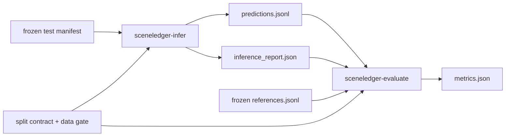

# 可靠基线评测门禁：原始解析证据与制品绑定

## 1. 为什么这是下一步实验的必要前置

当前基线先经过 `sceneledger-infer`：模型生成原始文本，parser 再把它转换成合法 Ledger JSONL。旧评测器只读取转换后的 Ledger，因此只要 JSONL 中存在一行——即使原始文本格式错误、tolerant parser 只恢复出空 Ledger——也会把 `strict_format_success` 默认记为 1。这会产生不可用的论文数字，并掩盖已经观察到的格式崩溃。

修复后的规则是：

- Event-F1、时间误差等只衡量 parser 最终恢复出的语义与时间；
- Strict-format 只衡量模型原始输出是否一次通过严格语法解析；
- 两组指标允许分离，例如 `Event-F1=1, Strict-format=0`；
- 没有 inference report 时 Strict-format 为 `null`，而不是 1；
- 正式冻结 split 必须同时提供 prediction、reference、split contract、data gate summary 和 inference report。

这让后续优化可以回答两个不同问题：模型是“不知道声音内容”，还是“知道内容但输出协议失败”。

## 2. 新的制品关系



`inference_report.json` 使用 `sceneledger-inference-report-v2`，至少冻结：

- 每个 `sample_id` 的 `strict_format_success` 和 parser warnings；
- 每个 `sample_id` 是否为所有事件显式生成了 `track="..."`；
- `prediction_path` 与 `prediction_sha256`；
- `dataset_id` 与 `expected_split`（冻结 split 实验）；
- 样本数、严格成功数/成功率及显式 track 证据数/完整率。

评测器会重新计算逐样本成功率并校验 prediction SHA-256。正式结果还要求
`pointer_metric=permutation_invariant_event_track_accuracy_v1`，并要求每条样本都有
“是否完整生成显式 track ID”的 parser 状态。缺失 track 是合法的模型失败，该样本
pointer 计 0；不能用 parser 按事件类型推断出的分组冒充 pointer 能力。
推理后手工替换 prediction、混用另一轮 report、缺失样本或重复 ID 都会失败。

## 3. 正式 test 命令

先推理：

```bash
python -m sceneledger.cli.infer \
  --manifest "$OUTPUT_ROOT/test/manifest.jsonl" \
  --audio-base "$OUTPUT_ROOT/test" \
  --backend moss \
  --model-path /path/to/MOSS-Audio-4B-Instruct \
  --lora-path outputs/b3_slot_aware_valid_v2/lora \
  --greedy \
  --include-lyrics \
  --track-aware \
  --split-contract "$OUTPUT_ROOT/gate/split_contract.json" \
  --data-gate-summary "$OUTPUT_ROOT/gate/experiment_data_summary.json" \
  --expected-split test \
  --output reports/b3_valid_v2_predictions.jsonl \
  --report reports/b3_valid_v2_infer_report.json
```

再评测；必须使用同一次推理生成的两个制品：

```bash
python -m sceneledger.cli.evaluate \
  --prediction reports/b3_valid_v2_predictions.jsonl \
  --reference "$OUTPUT_ROOT/gate/test_references.jsonl" \
  --inference-report reports/b3_valid_v2_infer_report.json \
  --split-contract "$OUTPUT_ROOT/gate/split_contract.json" \
  --data-gate-summary "$OUTPUT_ROOT/gate/experiment_data_summary.json" \
  --expected-split test \
  --output reports/b3_valid_v2_metrics.json \
  --pretty
```

不使用 frozen split 的探索性评测仍可省略 `--inference-report`，但输出中的 `strict_format_success_rate` 将是 `null`、`format_status_complete=false`。这种结果只能分析语义/时间恢复指标，不能汇报格式成功率。

## 4. 基线成立的顺序与停止条件

不要直接比较 SFT、slot 或 RL。先依次建立四个锚点：

1. **Mock round-trip**：同一 Ledger 序列化、解析、评测后 Event-F1 与 Strict-format 均为 1，验证工具链。
2. **MOSS zero-shot**：冻结 test 上保存 raw parser evidence，得到可复查的 B0，而不是只保留修复后的 Ledger。
3. **TAC-style SFT**：在相同 test、greedy decode 与解码预算下比较 B0/B2；只改变训练，不能改变 parser 或测试集。
4. **复杂场景分层**：按模板、源数、重叠比例、混响/噪声强度报告 Event-F1、边界误差、hallucination、omission 和 Strict-format。

出现以下任一情况，本轮不能进入结构创新对比：

- `strict_format_success_rate` 为 `null`；
- `format_status_complete=false`；
- `pointer_evidence_complete=false`，即并非每条样本都有显式 track 状态证据；
- prediction/report 哈希不匹配；
- report、reference 与 split contract 的 sample ID 不完全一致；
- data gate 或 human audit 未通过；
- 仅 synthetic placeholder 通过，却把结果表述为真实复杂音频有效。

## 5. 最小回传结果

服务器实验后请回传：

- prediction JSONL 与 inference report；
- metrics JSON；
- split contract、experiment data summary 与 human audit summary；
- 模型路径/commit、LoRA 路径、命令、seed、解码参数和运行日志。

其中 prediction 与 inference report 必须成对保存，任何一个被修改都应重新推理，不要手工更新哈希。
