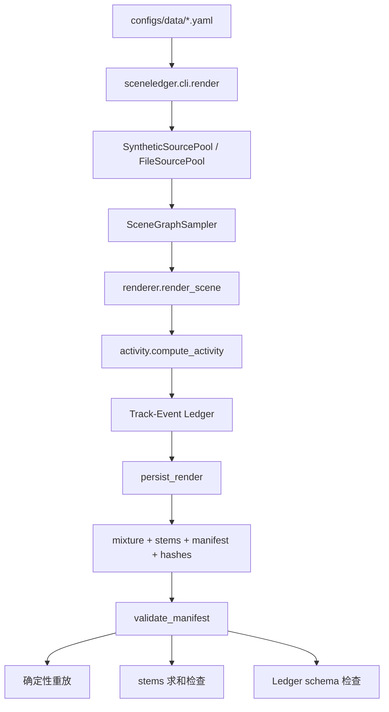
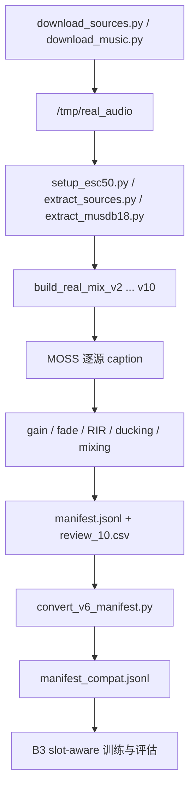
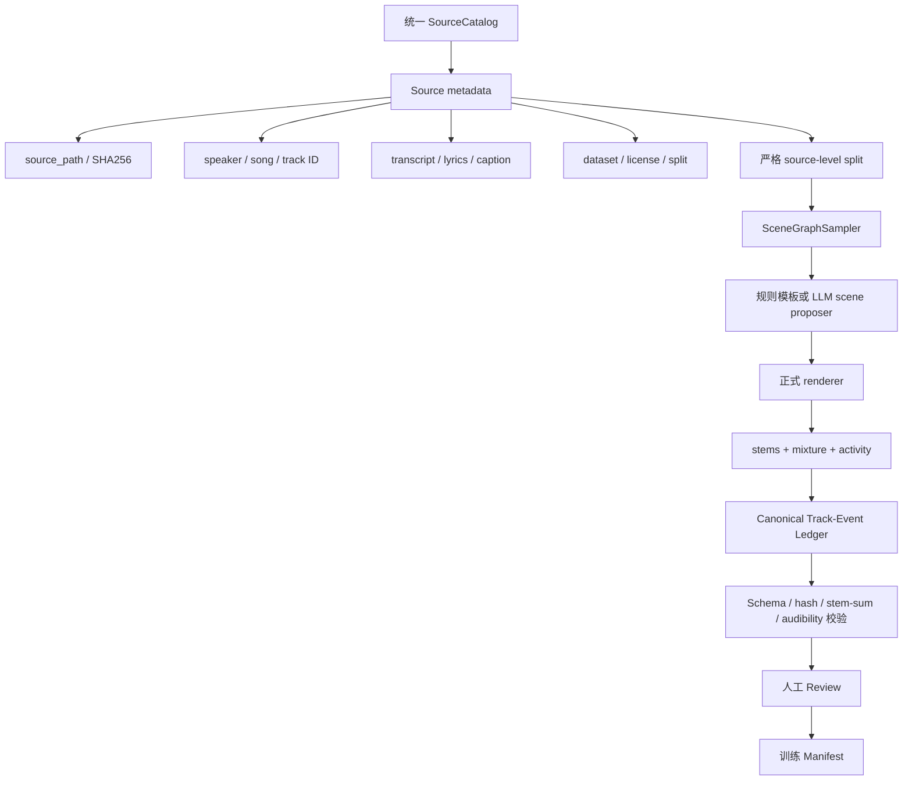

# 数据构造实验总结

> 整理日期：2026-08-17  
> 仓库版本：`fe3055b`  
> 分析范围：数据构造脚本、数据配置、现有数据产物及 `docs/15`—`docs/25` 实验文档

---

## 1. 总体结论

当前仓库不是一条统一的数据构造流水线，而是存在两套相互独立、能力互补的流程：

| 流水线 | 优点 | 核心问题 | 当前用途 |
|---|---|---|---|
| **A. 包内正式渲染管线** | 场景结构丰富；保存 stems、hash、活动区间和完整 Ledger；支持确定性重放与校验 | 当前配置全部使用程序合成音色；真实文件池尚未接通；现有切分仍可能发生源泄漏 | 合成实验 B1/B2/B3、slot-aware、CARC |
| **B. `scripts/` 真实音源混音管线** | 使用 ESC-50、GTZAN、LibriSpeech、MUSDB18 等真实音频；MOSS 逐源生成 caption | 硬编码路径；无可靠溯源、hash 和防泄漏；track/event 结构退化；绕过正式校验 | real_mix v2-v10 真实音频实验 |

两套流程可以概括为：

> **流水线 A 是“结构真、声音假”，流水线 B 是“声音真、结构弱”。**

当前最新脚本是 `scripts/build_real_mix_v10.py`，但它尚未形成可运行、可复现、经过实验验证的数据版本。目前仓库内最完整的合成数据是 `b3_5k`，最完整且可按 manifest 使用的真实数据主版本是 `real_mix_v6`。

---

## 2. 流水线 A：包内正式渲染

### 2.1 调用链

正式入口为：

```bash
python -m sceneledger.cli.render \
  --config configs/data/tac_mini.yaml \
  --output-dir data/derived/tac_mini \
  --validate
```

完整流程如下：



主要实现位置：

- 配置和入口：`src/sceneledger/cli/render.py`
- 场景采样：`src/sceneledger/data/scene_graph_sampler.py`
- 音频渲染：`src/sceneledger/data/renderer.py`
- 活动检测：`src/sceneledger/data/activity.py`
- Ledger schema：`src/sceneledger/data/schema.py`
- manifest 持久化和校验：`src/sceneledger/data/manifests.py`

### 2.2 现有配置

| 配置 | 样本数 | 主要目标 |
|---|---:|---|
| `configs/data/tac_mini.yaml` | 500 | TAC-style 基础场景 |
| `configs/data/b2_no_template.yaml` | 500 | 随机混音消融 |
| `configs/data/b3_unified.yaml` | 500 | 加入 lyrics 和双说话人 |
| `configs/data/b3_unified_5k.yaml` | 5000 | B3 扩量 |
| `configs/data/b3_unified_v2.yaml` | 5000 | 更复杂模板和音频增强 |

所有现有配置均为：

```yaml
pool:
  kind: synthetic
```

因此当前正式渲染数据均来自 `SyntheticSourcePool`，尚未真正使用真实文件池。

### 2.3 SyntheticSourcePool

程序按类型生成占位音频：

| 类型 | 生成方式 |
|---|---|
| `speech` | 共振峰式正弦音调和音节包络 |
| `vocal` | 带颤音、呼吸包络的持续音 |
| `music` | 程序生成的慢速和弦 |
| `sfx` | 短时噪声爆发 |
| `ambience` | 风、雨、室内底噪式连续噪声 |

其主要价值是：

1. 无版权依赖；
2. 可以确定性重放；
3. 容易验证时间结构；
4. 适合开发 parser、serializer、loss 和 event matching。

其局限是不能证明模型真实理解语音、音乐和自然音效。合成数据实验应被定位为格式、集合结构和时间监督机制验证，而不是真实能力验证。

### 2.4 FileSourcePool

仓库已经实现：

```python
FileSourcePool(
    by_kind={
        "speech": [...],
        "vocal": [...],
        "music": [...],
        "sfx": [...],
        "ambience": [...],
    }
)
```

但当前存在以下限制：

1. 所有配置仍使用 `kind: synthetic`；
2. `_build_pool()` 不会展开 `**/*.flac` 等 glob；
3. FileSourcePool 只返回 waveform，不返回 transcript、speaker ID、source hash、dataset 和 license；
4. 场景采样器仍使用 `_caption_for()` 生成通用文本，无法直接利用 LibriSpeech 转录或歌词标注；
5. provenance 仍固定写成 synthetic。

因此，“切换配置即可完成真实数据接入”目前并不完全成立，还需要扩展文件发现和 source metadata 接口。

### 2.5 场景模板

正式渲染器支持 13 类模板。

基础模板：

- `isolated_sfx`
- `speech_over_music`
- `music_with_sfx`
- `speech_music_sfx`
- `repeated_event`
- `ambient_with_intermittent_sfx`

B3 扩展模板：

- `lyrics_over_music`
- `speech_music_lyrics_sfx`
- `overlapping_speakers`

复杂模板：

- `complex_cocktail`
- `rich_band`
- `multi_event_dense`

消融模板：

- `random_mix`

其中：

- `overlapping_speakers` 可构造两个 speech track；
- `complex_cocktail` 可构造 3—4 个说话人；
- `rich_band` 同时包含 ambience、music、vocal 和多个 sfx；
- `repeated_event` 可生成同源重复实例和多 span；
- `lyrics_over_music` 可生成 vocal track 和 `lys` event。

正式管线的结构表达能力明显强于真实混音脚本。

### 2.6 每个源的渲染过程

单源处理顺序为：

```text
加载音频
→ gain
→ 按类型 fade
→ repeat
→ source-level RIR
→ 放置到时间轴
→ RMS 活动检测
```

不同类型的 fade 参数：

| 类型 | Fade |
|---|---:|
| ambience | 1.5 s |
| music | 0.5 s |
| vocal | 50 ms |
| speech | 50 ms |
| sfx | 50 ms |

混音阶段继续执行：

1. stems 求和形成 `dry_mixture`；
2. 必要时添加低音量 synthetic ambience；
3. speech/vocal 活跃时对 music/ambience 做 2—5 dB ducking；
4. 应用 scene-level echo；
5. 峰值超过 0.99 时整体归一化。

### 2.7 活动检测与时间戳

正式管线采用相对峰值 RMS 阈值：

\[
m(t)=\mathbf{1}\left[\mathrm{RMS}(t)>
\delta_{\text{act}}\cdot \max_t\mathrm{RMS}(t)\right]
\]

具体过程：

1. 使用 10 ms hop 计算 RMS；
2. 根据采样的相对阈值二值化；
3. 聚合到 supervision resolution；
4. 合并小于 `merge_threshold_s` 的间隙；
5. 转为活动 spans；
6. 最终由 schema 量化到 0.1 秒网格。

现有配置的 supervision resolution 为：

```yaml
resolutions: [0.1, 0.5, 1.0]
```

实测现有数据约只有三分之一直接使用 0.1 秒活动分辨率：

| 数据 | 0.1 s | 0.5 s | 1.0 s |
|---|---:|---:|---:|
| `tac_mini` | 161 | 153 | 186 |
| `b3_unified` | 162 | 161 | 177 |
| `b3_5k` | 1648 | 1690 | 1662 |

因此更准确的表述是：

> 当前数据使用 100 ms 序列化网格，但活动监督混合了 0.1、0.5 和 1.0 秒分辨率。

### 2.8 Track 和 Event 生成规则

一个实际 source 对应一个 persistent track。

不同类型的 event 规则：

- **speech**：每个活动 span 形成一个独立 event；
- **lyrics**：每个活动 span 形成一个 `lys` event，且 `verbatim=True`；
- **sfx**：同源重复实例合并为一个多 span event；
- **music/ambience**：形成一个 event，并保留检测出的 spans。

因此正式管线可以表达：

- track-to-event 一对多；
- 多说话人；
- lyrics；
- repeated event；
- multi-span；
- source identity；
- overlap ratio。

### 2.9 Manifest 格式

正式 manifest 包含：

```json
{
  "scene": {
    "scene_id": "mix_000001",
    "seed": 1947,
    "duration": 10.0,
    "template": "speech_over_music",
    "sources": [],
    "conditions": {},
    "supervision": {}
  },
  "mixture_path": "audio/mix_000001.wav",
  "stem_paths": {},
  "mixture_hash": "...",
  "dry_mixture_hash": "...",
  "stem_hashes": {},
  "activity_hashes": {},
  "target_ledger": {},
  "sample_rate": 24000
}
```

这套格式可支持：

- 确定性重放；
- stem-level CARC；
- source removal；
- activity 审计；
- source-level 调试；
- 条件分桶评测。

### 2.10 三道校验及其局限

`validate_manifest()` 检查：

1. 重新渲染后的 mixture hash 是否一致；
2. stems 是否精确求和为 `dry_mixture`；
3. target ledger 是否通过 schema。

但渲染器可能额外加入一个未记录的 synthetic ambience bed。该背景音：

- 不在 stems 中；
- 不生成 track；
- 不生成 event；
- 不进入 `dry_mixture`；
- 但存在于最终 mixture。

因此三道 gate 可以全部通过，同时最终音频中仍存在无标签背景源。

---

## 3. 流水线 B：真实音源混音

### 3.1 历史调用链



该流程绝大部分路径硬编码到：

- `/tmp/real_audio`
- `/tmp/real_mix_v*`
- `/tmp/moss_weights`

### 3.2 v2-v8 演化

#### v2：规则场景和真实音频

- ESC-50 作为 sfx/ambience；
- MOSS demo 音频作为 speech/music；
- 12 个规则场景；
- MOSS 逐源 caption。

主要问题包括人声不清晰、源数量少、gain 不合理和 caption 与实际源不一致。

#### v3：增强人声与扩充音源

尝试加入：

- LibriSpeech；
- FMA；
- UrbanSound8K；
- speech compression；
- vocal EQ；
- 更深的 ducking。

但后续版本没有完整继承这些数据源。

#### v3b-v5：人工 Review 驱动修正

逐步加入：

- speech gain 提升；
- ducking 扩展到所有非 speech 源；
- 每个实际加载源都重新执行 MOSS caption；
- 源 RMS 验证；
- 音乐加载日志。

#### v6/v6k：GTZAN 音乐版本

使用：

- GTZAN classical/jazz/blues；
- ESC-50；
- 两个 MOSS demo speech 文件。

生成规模：

- v6：200 条；
- v6k：1000 条。

v6k 是历史真实数据实验中整体 F1 最好的来源，但其 1000 条音频已经丢失，仅剩 manifest。

#### v7：RMS 时间戳和增强 caption

主要修改：

- 50 ms RMS 活动检测修正时间戳；
- 使用详细 MOSS prompt；
- 场景限定 ESC-50 类别白名单；
- speech compression 和 EQ；
- 6—8 dB ducking。

#### v8：简单 caption 和 v7 时间戳

保留 v7 的 RMS 时间戳，但 caption prompt 恢复为：

```text
Describe this audio in one sentence.
```

实验显示 v7/v8 改善了 onset MAE，但整体 event F1 低于 v6k。更精细的 RMS 时间戳和更详细的 caption 并没有自动提升整体性能。

---

## 4. 最新版本 v9 和 v10

### 4.1 v9：LLM 场景和参数生成

`build_real_mix_v9.py` 让 MOSS 输出场景 JSON：

```json
{
  "scene_name": "short name",
  "description": "scene description",
  "duration_s": 10,
  "sources": [
    {
      "role": "speech",
      "category": "English",
      "gain_db": 3,
      "onset_s": 1,
      "duck_others": true
    }
  ]
}
```

脚本随后根据 JSON 选择真实源并执行规则混音。

需要注意，文档与实现存在差异：

- 文档说 LLM 检查 caption-scene consistency，代码未实现；
- 文档说 LLM 设置时间戳，实际仍使用固定 RMS 检测；
- LLM 只负责 scene JSON proposal；
- 每源 caption 仍是一次独立 MOSS 推理；
- scene 生成失败时退化为两个随机 sfx；
- 没有对 LLM 输出做完整 schema 校验。

因此 v9 的准确定位是：

> **LLM 场景与参数 proposer，加规则执行器。**

当前仓库没有 v9 数据产物、训练配置和实验结果。

### 4.2 v10：新数据源版本

v10 计划使用：

| 类型 | 数据源 |
|---|---|
| speech | LibriSpeech train-clean-100 |
| music | MUSDB18 accompaniment，GTZAN fallback |
| vocal | MUSDB18 vocals |
| sfx/ambience | ESC-50、UrbanSound8K |

其计划流程为：

```text
MOSS 生成 scene JSON
→ 遍历场景中的 sources
→ 按角色从真实数据集中选择源
→ 截取片段
→ fade / compression / EQ
→ MOSS 对单源生成 caption
→ gain
→ 可选合成 RIR
→ 50 ms RMS 活动检测
→ 生成 track 和 event
→ speech-triggered ducking
→ 混音和峰值归一化
→ 写 WAV、manifest 和 review CSV
```

v10 相比旧版本的目标是解决：

1. speech 只有两个 demo 文件；
2. GTZAN 音乐可能含人声；
3. 没有 vocal/lyrics；
4. 固定模板的场景覆盖有限。

---

## 5. v10 当前关键问题

### 5.1 当前环境不可运行

当前实际输入源状态：

| 路径 | 状态 |
|---|---|
| LibriSpeech train-clean-100 | 存在，约 28,539 个 FLAC |
| MUSDB accompaniment | 缺失 |
| MUSDB vocals | 缺失 |
| ESC-50 WAV | 缺失 |
| GTZAN | 缺失 |
| UrbanSound8K | 缺失 |
| `/tmp/real_audio/esc50_category_map.json` | 缺失 |
| `/tmp/moss_weights` | 缺失 |

除 LibriSpeech 外，`data/sources/` 中其他条目均为指向 `/tmp/real_audio` 的失效软链接。

### 5.2 实际说话人数量与描述不一致

代码仅遍历：

```python
for speaker in os.listdir(LIBRISPEECH_DIR)[:50]:
```

并在累计 200 条 utterance 后返回。因此实际 speech pool 是：

- 最多 50 个说话人目录；
- 最多 200 条音频；
- `os.listdir()` 未排序，具体选择不稳定。

脚本和 commit 中“使用 251 speakers”的描述与实际执行逻辑不一致。

### 5.3 LibriSpeech transcript 未进入最终标签

加载阶段取得了 transcript，但混音时没有使用 `speech_desc`，最终 event text 仍由 MOSS 生成。因此：

- 无法直接做 WER/cpWER；
- 丢失 LibriSpeech 最重要的强监督；
- manifest 不保存 speaker ID；
- transcript 不具有可追溯性。

### 5.4 `vocal` event 不符合 schema

v10 将 MUSDB vocals 写为：

```json
{"type": "vocal"}
```

但 canonical EventType 只允许：

```text
speech / lys / music / sfx
```

`vocal` 只能作为 track kind，event 应映射为 `lys`。当前实现没有调用 `Ledger.model_validate()`，因此包含 vocal 的输出不符合 `schema v0.2.0`。

### 5.5 Track 和 Event 仍是一一对应

v10 每加载一个 source 就创建一个 track 和一个 event：

```text
一个 source = 一个 track = 一个 event = 一个 span
```

仍然没有：

- 同一 speaker 的多个 event；
- 同一 track 的多次发声；
- repeated event；
- multi-span event；
- 有效的 event-to-track pointer 监督。

### 5.6 未保存源路径与 identity

当前 `sources_info` 不保存：

- source path；
- source SHA256；
- LibriSpeech speaker/chapter/utterance ID；
- MUSDB track ID；
- source crop start/end；
- ESC-50/UrbanSound 文件 ID。

因此不能实现：

- 按说话人或歌曲切分；
- 源级防泄漏；
- 确定性重放；
- 数据审计；
- 错误样本溯源。

### 5.7 时间戳仍是粗粒度活动外包围框

v10 使用：

1. 50 ms 固定帧；
2. 固定绝对阈值 `0.005`；
3. 合并小于 0.1 秒的间隙；
4. 第一个活动 span 的开始作为 onset；
5. 最后一个活动 span 的结束作为 offset。

中间所有静音被压成一个连续区间。它不能表达：

- 一段 speech 中的多句；
- vocal 中的多行；
- 间歇性 sfx；
- 同源多事件。

### 5.8 Caption 与最终 mixture 不完全对应

MOSS caption 在以下处理前生成：

- gain；
- RIR；
- ducking；
- 与其他源叠加；
- mixture normalization。

因此 caption 描述的是孤立原始源，而不是最终 mixture 中的可听结果。当前也没有实现混音后 mixture caption 或 audibility consistency 检查。

### 5.9 许可记录过于粗糙

v10 对所有数据统一写：

```json
"license_status": "CC"
```

不同数据集许可和再分发条件不同，必须至少在 source 级别记录 dataset、license 和 redistribution policy。

---

## 6. 现有数据产物状态

### 6.1 合成数据

| 数据目录 | Manifest | Manifest 记录路径可用 |
|---|---:|---:|
| `tac_mini` | 500 | 500/500 |
| `b2_no_template` | 500 | 500/500 |
| `b3_unified` | 500 | 500/500 |
| `b3_5k` | 5000 | 5000/5000 |
| `b3_v2` | 5000 | 0/5000 |

`b3_v2` 只有 manifest，没有对应音频。

### 6.2 真实混音数据

| 数据目录 | Manifest | Manifest 记录路径可用 |
|---|---:|---:|
| `real_mix` | 200 | 0/200 |
| `real_mix_v2` | 200 | 10/200 |
| `real_mix_v3b` | 200 | 200/200 |
| `real_mix_v4` | 200 | 200/200 |
| `real_mix_v5` | 200 | 200/200 |
| `real_mix_v6` | 200 | 200/200 |
| `real_mix_v6_1k` | 1000 | 0/1000 |
| `real_mix_v7` | 1000 | 0/1000 |
| `real_mix_v8` | 1000 | 0/1000 |
| v9 | 无 | 无 |
| v10 | 无 | 无 |

v7 目录中实际存在 999 个 WAV，但文件位于目录根部，而 manifest 记录的是 `audio/*.wav`，因此无法按现有 manifest 直接加载。

当前真正完整、可按 manifest 使用的真实数据主要为：

- `real_mix_v3b`
- `real_mix_v4`
- `real_mix_v5`
- `real_mix_v6`

其中相对最值得继续保留和审计的是 `real_mix_v6`。

---

## 7. 数据结构实测

### 7.1 正式合成数据

| 数据 | 样本数 | 平均 Event | 平均 Track | `lys` Event | Multi-span Event |
|---|---:|---:|---:|---:|---:|
| `tac_mini` | 500 | 2.004 | 2.004 | 0 | 27 |
| `b3_unified` | 500 | 2.242 | 2.240 | 137 | 22 |
| `b3_5k` | 5000 | 2.265 | 2.261 | 1380 | 178 |
| `b3_v2` | 5000 | 3.023 | 3.017 | 1525 | 116 |

正式管线确实能够构造：

- lyrics；
- 多说话人；
- 多 event；
- multi-span；
- 更高场景复杂度。

### 7.2 真实混音数据

以 v6k 为例：

- 1000 条 mixture；
- 2740 个 event；
- `events-per-track = {1: 2740}`；
- speech track 数只可能为 0 或 1；
- `lys = 0`；
- 所有 event 都只有一个 span；
- `conditions` 为空；
- source path 缺失。

v7/v8 虽然修正了时间戳和 caption prompt，但结构仍然是 track-event 一一对应。

---

## 8. 数据切分问题

### 8.1 正式管线的 group split 不是严格源隔离

当前 `_group_key()` 对一条 mixture 的全部源路径集合求 SHA1：

```python
group = sha1(path_1 | path_2 | path_3)
```

它只能保证完全相同的源组合不会跨集合，不能保证单个源不跨集合。

例如：

```text
训练：speech_A + music_B
验证：speech_A + music_C
```

两个组合 hash 不同，但 `speech_A` 已发生泄漏。

实测验证集源路径泄漏比例：

| 数据 | 验证源同时出现在训练集的比例 |
|---|---:|
| `tac_mini` | 18.1% |
| `b3_unified` | 14.4% |
| `b3_5k` | 87.8% |
| `b3_v2` | 92.1% |

正确做法应是先对原始 source 分配 split，再只允许同一 split 内的源组成 mixture。

### 8.2 真实 compat manifest 的分组退化

`convert_v6_manifest.py` 将源路径写为：

```text
real:speech
real:music
real:sfx
```

因此 group 实际只是角色组合。

| 数据 | Group 数 | 训练/验证 |
|---|---:|---:|
| v6 | 6 | 131/69 |
| v6k | 6 | 702/298 |
| v7 | 9 | 919/81 |
| v8 | 9 | 919/81 |

v7/v8 的验证集甚至只包含 `workshop` 一个模板。该切分不能被视为正常源隔离验证。

此外，`scripts/eval_heldout.py` 使用：

```python
held_out = manifest[180:]
```

它与训练阶段的 group split 不是同一个验证集定义。当前真实实验至少存在训练 group split、末尾索引切分和报告 held-out 列表三种不一致的划分方式。

---

## 9. 其他实现风险

### 9.1 Scene 内 source ID 可能碰撞

source ID 通过随机数生成：

```python
f"{kind[0].upper()}{rng.randint(1, 99):02d}"
```

同类型多个源可能产生相同 ID，导致 `stem_paths` 字典覆盖。

实测冲突场景数：

| 数据 | Source ID 冲突场景 |
|---|---:|
| `tac_mini` | 2 |
| `b3_unified` | 4 |
| `b3_5k` | 24 |
| `b3_v2` | 78 |

应改为基于 scene 内源序号生成唯一 ID。

### 9.2 FileSourcePool provenance 错误

正式 renderer 固定写：

```json
{
  "source_dataset": "tac_mini_synthetic",
  "license_status": "synthetic"
}
```

即使未来启用 FileSourcePool，manifest 仍会错误标记为 synthetic。

### 9.3 `subgroup_count` 当前未生效

数据 YAML 中存在：

```yaml
subgroup_count: 5
```

但 `render.py` 没有读取该字段，它不会自动生成五个源隔离 subgroup。

---

## 10. 实验结论汇总

### 10.1 已经得到支持的结论

1. 合成数据可以验证格式、时间结构和排列不变训练，但不能代表真实音频理解；
2. 少量真实音频训练已经明显优于大量合成音色；
3. v6k 从 200 条扩展到 1000 条，没有解决时间边界和声源归属；
4. v7/v8 的 RMS 时间戳改善 onset MAE，但整体 F1 下降；
5. 更详细的 MOSS prompt 可能同时增加描述信息和幻觉；
6. GTZAN 不能可靠视为纯器乐；
7. LibriSpeech 和 MUSDB18 是当前最重要的数据源；
8. 当前瓶颈主要是数据结构和可追溯性，不是样本数量。

### 10.2 当前最强历史结果的限制

v6k 的 F1=0.970 不能直接解释为真实复杂音频能力已经解决，原因包括：

- 训练和验证可能共享原始 source；
- speech 只来自极少数 demo 文件；
- track-event 100% 一一对应；
- 没有多说话人；
- 没有 lyrics；
- 没有 multi-span；
- 没有 source path 和 hash；
- 音频已经丢失，无法复现；
- teacher、底座和部分评价信号均来自 MOSS 系列。

因此该结果更准确地证明：

> 在相近源分布和简单结构下，MOSS 可以学习规范的事件格式和粗时间范围。

---

## 11. 当前版本判断

需要区分三个“当前版本”。

### 11.1 最新代码版本

```text
scripts/build_real_mix_v10.py
```

特点：

- LLM 场景生成；
- LibriSpeech；
- MUSDB18 accompaniment/vocals；
- ESC-50/UrbanSound8K；
- MOSS 每源 caption。

但当前不可运行、没有数据产物，并存在非法 `vocal` event 等问题。

### 11.2 最新完成过实验的版本

```text
real_mix_v8
```

但其 manifest 记录的音频路径不可用，无法完整复现。

### 11.3 当前仓库完整可用的真实版本

```text
real_mix_v6
```

它具有 200 条完整音频、manifest、compat manifest 以及已有训练报告，但仍存在源溯源、防泄漏和结构退化问题。

---

## 12. 建议的统一数据构造流程

不建议继续增加 `build_real_mix_v11.py` 等平行脚本。应将真实音源接入正式 renderer，形成统一流程：



### 12.1 P0：保证可复现

1. 所有路径改为 argparse 或配置；
2. 禁止把素材和输出放在 `/tmp`；
3. MOSS 权重迁到持久目录；
4. 保存 source path、SHA256 和 crop start/end；
5. 保存 speaker/song/track ID；
6. 文件发现顺序必须排序；
7. 数据生成完成后记录完整配置和代码 commit。

### 12.2 P0：修复 v10 schema 和标签

1. `vocal` track 映射为合法的 `lys` event；
2. LibriSpeech transcript 直接作为 verbatim speech target；
3. MUSDB vocals 没有歌词时只能标 singing/vocal 描述，不能伪造 verbatim lyrics；
4. 每条 ledger 强制执行：

```python
Ledger.model_validate(ledger)
```

### 12.3 P0：实现真正源隔离切分

先对原始 source 分配 train/val/test：

- speech 按 speaker；
- music/vocal 按歌曲或 MUSDB track；
- sfx 按原始文件；
- 视频数据按原视频或 uploader。

每条 mixture 只能从同一 split 的源中构造。最终必须审计：

```text
train_source_ids ∩ val_source_ids = ∅
train_speakers ∩ val_speakers = ∅
train_songs ∩ val_songs = ∅
```

### 12.4 P1：扩展 SourcePool 接口

建议将：

```python
load(path) -> waveform
```

升级为：

```python
SourceRecord(
    path,
    source_id,
    speaker_id,
    track_id,
    waveform,
    transcript,
    lyrics,
    caption,
    dataset,
    license,
    sha256,
)
```

### 12.5 P1：限制 LLM 的职责

LLM 可以用于：

- 场景组合 proposal；
- gain/onset 建议；
- 类别合理性筛选；
- teacher 冲突解释。

最终标签应优先来自：

- LibriSpeech transcript；
- 数据集类别；
- MUSDB stem identity；
- VAD/activity；
- 人工标注；
- 多教师一致性。

不应让同一个 MOSS 同时承担：

- 场景生成；
- caption teacher；
- 学生底座；
- 质量判断。

---

## 13. 最终总结

当前仓库已经完成两个互补的数据构造原型：

1. **正式渲染器**能够生成多说话人、lyrics、多 span、conditions、stems 和完整 Track-Event Ledger，但当前主要使用不可辨认的程序合成音色；
2. **真实混音脚本**能够使用真实音源，且已经演进到 v10，但仍缺少源溯源、严格切分、schema 校验和有效的 track-event 多对一结构。

因此，下一步的核心工作不应是继续扩大样本数量或增加混音版本，而应是：

> **建立统一 SourceCatalog，将 LibriSpeech、MUSDB18、ESC-50 等真实素材接入正式 renderer，同时修复 source-level split、metadata、schema validation、时间监督和可复现性。**

只有完成这一步，数据才能同时满足：

- 音频内容真实；
- Track-Event 结构有效；
- 时间标签可审计；
- 训练/验证无源泄漏；
- 数据能够确定性重放；
- 实验结果能够复现。

---

## 14. 结合 LLM 辅助混音方案后的下一步判断

`docs/25_llm_assisted_mixing_plan.md` 提出的核心方向是让 LLM 辅助生成场景、选择音源并设置混音参数。结合当前 v9/v10 实现和已有实验结果，下一步不能简单理解为“让 LLM 再生成 1000 个更丰富的场景”。

已有实验已经表明：

1. 200 条真实数据充分训练后，整体事件 F1 已经接近饱和；
2. 从 200 条扩展到 1000 条，整体 F1 提升很小；
3. 数据扩量没有解决时间边界、说话人归属、事件到 Track 的指向和多说话人重叠问题；
4. v9/v10 虽然加入了 LLM 场景生成，但后续仍基本按照“一个 source 对应一个 Track 和一个 Event”构造标签；
5. 当前真正缺少的是结构监督，而不是更多场景名称和自然语言描述。

因此，LLM 在下一批数据中的正确职责应该是：

> **按照预先规定的结构目标规划 Track、Event 和混音关系，而不是直接生成最终标签真值。**

LLM 可以负责：

- 生成合理的场景类型；
- 决定需要几个 Track；
- 规划同一个 Track 下有几个 Event；
- 规划哪些事件交替、重叠或重复；
- 建议 source 类型、onset 范围、gain 和前后景关系；
- 检查场景中的音源组合是否符合常识。

LLM 不应负责：

- 覆盖 LibriSpeech 的真实 transcript；
- 凭自然语言猜测 100 ms 时间边界；
- 将没有歌词标注的 vocal stem 直接转成 verbatim lyrics；
- 单独决定某个事件是否真实可听；
- 同时作为场景生成器、caption teacher、学生底座和质量评估器。

最终标签应优先来自：

- LibriSpeech transcript 和 speaker ID；
- MUSDB18 的 track/stem identity；
- ESC-50、UrbanSound8K 的数据集类别；
- 独立 stem 的实际放置位置和 activity/VAD；
- 确定性渲染参数；
- 必要的人工抽检。

### 14.1 LLM 输出应从扁平 Source 列表升级为 Track-Event 计划

当前 v9/v10 主要输出：

```json
{
  "sources": [
    {"role": "speech", "onset_s": 1.0},
    {"role": "music", "onset_s": 0.0}
  ]
}
```

下一版应输出显式 Track-Event 结构：

```json
{
  "scene_name": "office conversation",
  "duration_sec": 12.0,
  "tracks": [
    {
      "track_slot": "S1",
      "role": "speech",
      "events": [
        {"event_slot": "E1", "onset_s": 1.0},
        {"event_slot": "E3", "onset_s": 7.0}
      ]
    },
    {
      "track_slot": "S2",
      "role": "speech",
      "events": [
        {"event_slot": "E2", "onset_s": 2.5}
      ]
    },
    {
      "track_slot": "M1",
      "role": "music",
      "events": [
        {"event_slot": "E4", "onset_s": 0.0}
      ]
    }
  ]
}
```

这样才能明确表达：

- 同一说话人跨时间多次发声；
- 多个 Event 共享一个 Track；
- 多说话人交替或重叠；
- 同源音效重复出现；
- Event-to-Track pointer。

LLM 输出必须经过 JSON Schema 或 Pydantic 校验，不合法时重新生成或回退到规则模板。

### 14.2 第一优先级任务

接下来首先应开展的数据构造任务是：

> **构造一批可追溯、源隔离、具有真实 Track-Event 结构的真实音频数据，并用它验证“结构监督是否比单纯扩量更有效”。**

在生成数据前必须先完成：

1. 将所有真实素材迁移到持久目录，移除对 `/tmp` 的依赖；
2. 建立统一 SourceCatalog；
3. 按 speaker、song 和原始音频文件预先划分 train/validation/test；
4. 定义模型真正能够学习的 Track pointer 序列化格式；
5. 将真实音源接入正式 renderer，或至少输出与正式 ManifestEntry 等价的信息。

特别需要注意：当前 slot-aware 输出主要只有事件计数和事件内容，如果输出字符串和 parser 中没有显式 `track_id`，即使数据 manifest 中写了 Track-Event 关系，模型也无法学习 pointer。因此造数前必须先锁定类似以下目标格式：

```text
<n>3</n>
<slot track="T1"><speech><|t_010|>...<|t_025|></speech></slot>
<slot track="T2"><speech><|t_020|>...<|t_040|></speech></slot>
<slot track="T1"><speech><|t_060|>...<|t_075|></speech></slot>
```

否则新的结构化数据仍会在训练格式化阶段丢失 Track 信息。

---

## 15. 新一轮 1000 条数据快速迭代方案

### 15.1 实验目标

这 1000 条数据的主要目标不是再次追求更高的普通 event F1，而是快速验证：

1. 同一 Track 多 Event 是否可学；
2. 多说话人交替和重叠是否可学；
3. Event-to-Track pointer 是否可学；
4. 真实 stem 活动区间是否能改善时间监督；
5. 严格源隔离后，模型性能是否仍然成立；
6. 这套数据结构能否稳定扩展到 5000 条以上。

建议暂定名称：

```text
real_mix_structured_1k
```

### 15.2 第一版任务范围

为了快速迭代，第一批建议只覆盖：

- `speech`
- `music`
- `sfx`

暂时不把无歌词标注的 MUSDB vocal stem 强行写成 `lys`。

原因是 MUSDB vocals 只有分轨，不一定有准确歌词及逐行时间对齐。若直接使用 MOSS 猜歌词，会引入高风险伪标签。Lyrics 应在后续接入 JamendoLyrics、DALI、OpenCPOP 或 M4Singer 等有歌词对齐的数据后再加入。

### 15.3 数据源

第一批建议使用：

| 类型 | 数据源 | 标签来源 |
|---|---|---|
| speech | LibriSpeech train-clean-100 | 原始 transcript、speaker ID、utterance ID |
| music | MUSDB18 accompaniment | track ID、stem identity，保证无 vocals |
| sfx | ESC-50，必要时补 UrbanSound8K | 原始 category 和文件 ID |

所有源必须先写入统一 SourceCatalog，例如：

```json
{
  "source_id": "librispeech_19_198_0001",
  "path": "data/sources/librispeech/...",
  "sha256": "...",
  "source_type": "speech",
  "dataset": "LibriSpeech",
  "speaker_id": "19",
  "utterance_id": "19-198-0001",
  "transcript": "THE BOY WAS THERE WHEN THE SUN ROSE",
  "duration_sec": 3.42,
  "license": "CC BY 4.0",
  "split": "train"
}
```

### 15.4 先切分 Source，再生成 Mixture

建议将 1000 条最终 mixture 固定为：

| Split | 数量 | 用途 |
|---|---:|---|
| Train | 800 | 快速训练 |
| Validation | 100 | 调参和早停 |
| Test | 100 | 冻结评估 |

切分必须在混音前完成：

- speech 按 `speaker_id` 切分；
- music 按 MUSDB `track_id` 切分；
- sfx 按原始文件 ID 切分；
- 同一首 MUSDB 歌曲的所有 stems 必须处于同一 split；
- 同一原始文件的不同截段不能跨 split。

必须满足：

```text
train_source_ids ∩ val_source_ids = ∅
train_source_ids ∩ test_source_ids = ∅
train_speakers ∩ val_speakers = ∅
train_speakers ∩ test_speakers = ∅
train_songs ∩ val_songs = ∅
train_songs ∩ test_songs = ∅
```

### 15.5 1000 条场景配额

建议采用以下固定配额，保证每一种关键结构都有足够样本：

| 场景结构 | 数量 | 主要监督目标 |
|---|---:|---|
| 单说话人、多 utterance | 180 | 同一 Track 对应多个 Event |
| 双说话人交替讲话 | 150 | speaker identity 和跨时间复现 |
| 双说话人重叠讲话 | 180 | 重叠检测和 pointer |
| 三说话人 cocktail | 80 | source count 和复杂重叠 |
| Speech + instrumental music | 150 | 音乐遮蔽下的 speech 定位 |
| 同源重复 SFX / multi-span | 100 | repeated event 和 multi-span |
| Speech + music + SFX | 110 | 三类共现和复杂场景 |
| 简单 music/SFX/negative 对照 | 50 | 校准、误报和简单场景基线 |
| **总计** | **1000** |  |

建议整体达到：

- 至少 30% 的 Track 对应两个以上 Event；
- 至少 25% 的 clip 含两个以上 speaker；
- 至少 15% 的 Event 为 multi-span；
- source 数覆盖 1—5；
- event 数覆盖 1—8；
- 不允许数据长期集中在 2—3 个 source；
- 重叠比例覆盖低、中、高三个区间。

### 15.6 场景和混音参数

建议第一版限制在容易控制和快速训练的范围：

| 参数 | 建议范围 |
|---|---|
| Clip 时长 | 8—15 秒 |
| Track 数 | 1—5 |
| Event 数 | 1—8 |
| 时间网格 | 输出为 0.1 秒，同时保存未量化原始边界 |
| Speech gain | 参考前景，约 -3 至 +3 dB |
| Music 相对 speech | -15 至 -5 dB |
| SFX 相对 speech | -10 至 0 dB |
| Speech overlap | 0%、轻度、重度分桶 |
| RIR | 第一版可选 20%—30%，不要过强 |
| Echo/codec | 第一版少量或关闭，避免变量过多 |
| Ducking | 保留开/关对照，不全部启用 |

第一轮的原则是：

> **先验证 Track-Event 结构，暂时不要同时引入过多复杂声学退化。**

### 15.7 标签生成原则

#### Speech

- Event text 直接使用 LibriSpeech transcript；
- `verbatim=true`；
- speaker ID 写入 Track identity；
- 同一 speaker 的多条 utterance 必须共享同一个 Track；
- 每条 utterance 是一个独立 Event；
- 时间由实际放置位置和 VAD/activity 共同确定。

#### Music

- 只使用 MUSDB accompaniment；
- Track identity 使用歌曲或 accompaniment source ID；
- 文本第一版可使用保守描述，如 `instrumental music`；
- MOSS caption 只能作为辅助字段，不能覆盖 stem identity；
- 必须保存歌曲 ID 和截取区间。

#### SFX

- 文本至少包含原始数据集 category；
- 同一个源文件重复出现时共享 Track；
- 语义相同的重复实例可以合并为 multi-span Event；
- 若拆成多个 Event，也必须保留相同 `track_id`；
- MOSS 自然语言描述可作为辅助 caption，但必须经过类别一致性检查。

### 15.8 LLM 的使用方式

为了兼顾快速迭代和可控性，建议采用：

```text
固定结构配额
→ LLM 在配额内生成场景计划
→ Pydantic 校验
→ 确定性程序分配真实 source
→ 正式 renderer 执行
```

不建议让 LLM自由决定所有数据分布，否则可能出现：

- 过多类似场景；
- speaker 数不足；
- 同一 Track 多 Event 比例不足；
- 大量不合法 JSON；
- gain 和 onset 超出范围；
- 结构配额失衡。

更合适的 prompt 方式是告诉 LLM当前样本必须满足的结构，例如：

```text
Generate one 12-second office scene.
Requirements:
- exactly two speech tracks;
- speaker S1 has two separate events;
- speaker S2 has one event;
- at least one overlap between S1 and S2;
- one low-volume instrumental music track;
- output only the required JSON schema.
```

### 15.9 数据构造执行顺序

建议按照以下顺序推进：

#### 第 0 步：锁定训练目标格式

- 增加显式 `track_id` 序列化；
- parser 能解析 pointer；
- metric 能计算 pointer accuracy；
- 用 5—10 条手工 Ledger 完成 round-trip 测试。

#### 第 1 步：恢复素材和建立 SourceCatalog

- 移除失效 `/tmp` 软链接；
- 固定 LibriSpeech、MUSDB18、ESC-50 路径；
- 生成 SHA256；
- 写入 speaker/song/file identity；
- 生成 source-level split。

#### 第 2 步：生成 20 条 Smoke Test

覆盖：

- 同 speaker 两个 Event；
- 双 speaker 重叠；
- 同源 SFX multi-span；
- speech + music；
- speech + music + sfx。

检查完整 manifest、stems、时间戳和 target serialization。

#### 第 3 步：扩展到 100 条并人工 Review

对 100 条全部或至少 50 条进行人工检查：

- 场景是否合理；
- 所有标注源是否可听；
- speaker 是否正确；
- transcript 是否对应；
- onset/offset 是否明显偏移；
- 是否存在漏标和无标签背景音；
- multi-span 是否合理。

#### 第 4 步：一次性生成完整 1000 条

只有 Smoke Test 和人工 Review 通过后，才生成完整数据，避免重复制造错误数据。

#### 第 5 步：快速训练与评估

建议至少比较：

1. 原真实数据训练基线；
2. 新数据去掉 Track pointer 的版本；
3. 新结构化数据完整版本；
4. 可选：去掉 LLM 场景规划、只用规则模板的版本。

### 15.10 数据输出目录

建议产物结构：

```text
data/sources/
├── source_catalog.jsonl
├── source_split.json
└── SOURCES.sha256

configs/data/
└── real_mix_structured_1k.yaml

data/derived/real_mix_structured_1k/
├── audio/
│   ├── mixtures/
│   └── stems/
├── scene_plans/
├── manifest.jsonl
├── data_card.md
├── split_audit.json
├── validation_report.json
└── review_50.csv
```

每条 manifest 至少应保存：

- mixture path 和 hash；
- 所有 stem path 和 hash；
- 原始 source path、source ID 和 SHA256；
- speaker/song/file identity；
- source crop start/end；
- scene plan；
- gain、onset、RIR、ducking 等参数；
- Track 和 Event；
- 原始未量化时间；
- 0.1 秒量化时间；
- conditions；
- split；
- label provenance；
- renderer 版本和代码 commit。

### 15.11 验收标准

#### 工程验收

- `Ledger.model_validate()` 通过率 100%；
- 确定性重放 hash 一致率 100%；
- 标注 stems 求和与 dry mixture 一致；
- 不允许存在未记录的背景源；
- 所有 source path 均存在；
- 所有 source SHA256 可复核；
- 训练、验证和测试源零交集。

#### 结构验收

- 至少 30% Track 有两个以上 Event；
- 至少 25% clip 有两个以上 speaker；
- 至少 15% Event 为 multi-span；
- pointer 字段覆盖率 100%；
- speech Track identity 覆盖率 100%；
- source 数、event 数和 overlap 分布符合预设配额。

#### 标签验收

- Speech transcript 直接来自 LibriSpeech；
- 不出现 `type="vocal"` 等非法 Event；
- accompaniment 不应被标为 singing；
- SFX 文本与数据集 category 一致；
- caption 不按固定字符数直接截断；
- 不出现 `There is no speech`、`no audible sound` 等退化标签。

#### 人工验收

至少分层抽查 50 条：

- 每种场景结构均有样本；
- Train/Validation/Test 均有样本；
- 高、中、低 overlap 均有样本；
- 审核场景合理性、可听性、时间边界、speaker、caption 和漏标。

### 15.12 快速实验应重点报告的指标

普通 event F1 仍需报告，但不能作为唯一指标。建议重点比较：

- Event semantic-temporal F1；
- onset/offset MAE；
- ±0.1/0.25/0.5/1.0 秒命中率；
- source count MAE；
- Track count MAE；
- Event-to-Track pointer accuracy；
- 同 speaker 跨时间事件聚类准确率；
- 双说话人重叠 recall；
- multi-span detection F1；
- hallucination 和漏检；
- 按 overlap ratio、source count 和事件数分桶的性能。

### 15.13 扩展到更大规模的条件

1000 条数据通过以下条件后，才建议扩展到 5000—10000 条：

1. pointer accuracy 显著高于随机或简单规则基线；
2. 多说话人重叠 recall 相比旧数据有明确提升；
3. 严格源隔离 test 上的结果方向成立；
4. 100 ms 边界至少没有明显退化；
5. 人工 Review 中严重标签错误率低于预设阈值；
6. 重新渲染和 source audit 可以自动执行；
7. 数据扩量只需修改 YAML 中的数量和配额，不需要复制新脚本。

若上述条件不成立，应先修正：

- target 格式；
- pointer loss；
- speaker identity；
- activity/VAD；
- scene plan；
- source selection；

而不是直接继续扩量。

---

## 16. 新一轮 1000 条数据方案精炼总结

如果要快速构造 1000 条数据开展新一轮实验，推荐采用以下最小闭环：

1. **只使用真实且有可靠身份信息的源**：LibriSpeech speech、MUSDB18 accompaniment、ESC-50/UrbanSound8K sfx；
2. **暂缓无对齐歌词的 vocal/lyrics**，避免产生错误 `lys` 标签；
3. **先按 speaker、song 和原始文件切分源**，再在各 split 内生成 800/100/100 条 mixture；
4. **让 LLM生成受约束的 Track-Event 场景计划**，而不是自由生成扁平 source 列表；
5. **重点构造同一 speaker 多 Event、多 speaker 重叠和同源 SFX multi-span**；
6. **Speech 文本直接使用 LibriSpeech transcript**，不再由 MOSS 覆盖；
7. **使用正式 renderer 保存 mixture、stems、activity、hash 和完整 Ledger**；
8. **训练输出中显式加入 track pointer**，否则 Track 结构无法被模型学习；
9. **先生成 20 条 smoke，再 Review 50—100 条，最后扩到完整 1000 条**；
10. **用 pointer、重叠 recall、multi-span、边界和严格源隔离测试作为主要验证指标**。

这批数据的核心价值不在于数量本身，而在于首次把：

```text
真实音频
+ 同一 Track 多 Event
+ 多说话人重叠
+ Event-to-Track pointer
+ 可追溯 source
+ 严格无泄漏切分
+ 可重放 stems
```

放入同一个可训练、可评估的数据闭环中。若 1000 条规模验证有效，后续即可通过增加 SourceCatalog 和配置中的样本数，稳定扩展到 5000 条及更大规模。
